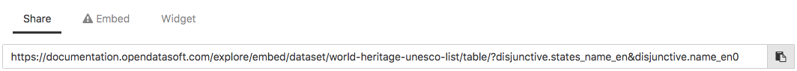
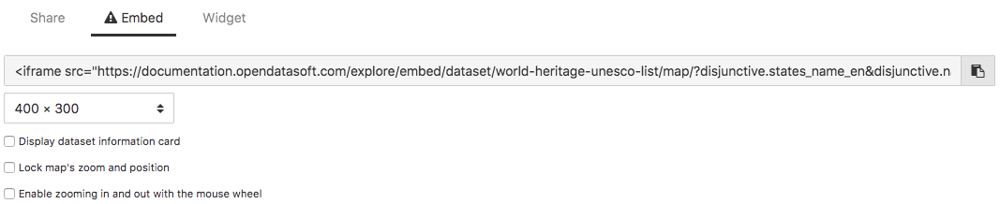
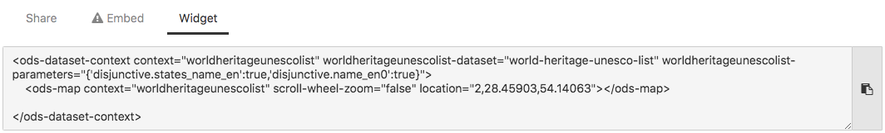

Sharing & embedding data visualizations
=======================================

Below each visualization are displayed 3 tabs: Share, Embed and Widget. These tabs contain links or pieces of code that allow to share or embed the visualization either elsewhere on the portal or on another website.

.. admonition:: Important
   :class: important

   All links and codes that can be copied, to either share or embed the visualization, are dynamic. It means that if the visualization is filtered beforehand, the link/code changes to take into account these filters.

Sharing a data visualization
----------------------------

The Share tab below a visualization contains a URL to share a direct access to the visualization.

Click on the copy button |icon-copypaste| to copy the URL.

Embedding a data visualization
------------------------------

Data visualizations can either be embedded via an iframe or as a widget. Both are pieces of code that allow anyone to integrate an element directly on a webpage.

An iframe is a way to easily and safely integrate OpenDataSoft content in an isolated frame, independent from the rest of the page. For integrating OpenDataSoft content outside the OpenDataSoft environment, iframes are the best way to go. In terms of interaction and customization, some work would probably be needed.
`Widgets <https://help.opendatasoft.com/widgets/#/api/>`_ could also be integrated into a page outside the OpenDataSoft environment, but heavy work would be required. They are however ideal for integrating content inside the OpenDataSoft environment. Widgets can also interact with other widgets, which for instance allow the creation of dynamic dashboards using OpenDataSoft.

Embedding an iframe
^^^^^^^^^^^^^^^^^^^

The Embed tab below a visualization contains the iframe code of that visualization.

1. Choose the size of the iframe, from the drop-down list.
2. Choose whether or not to display the dataset information card above the iframe.
3. Choose whether or not to lock the map's zoom and position (*for map visualizations only*).
4. Choose whether or not to enable zooming in and out with the mouse wheel (*for map visualizations only*).
5. Click |icon-copypaste| to copy the iframe code.

Embedding a widget
^^^^^^^^^^^^^^^^^^

The Widget tab below a visualization contains the widget code of that visualization.

Click |icon-copypaste| to copy the widget code.

