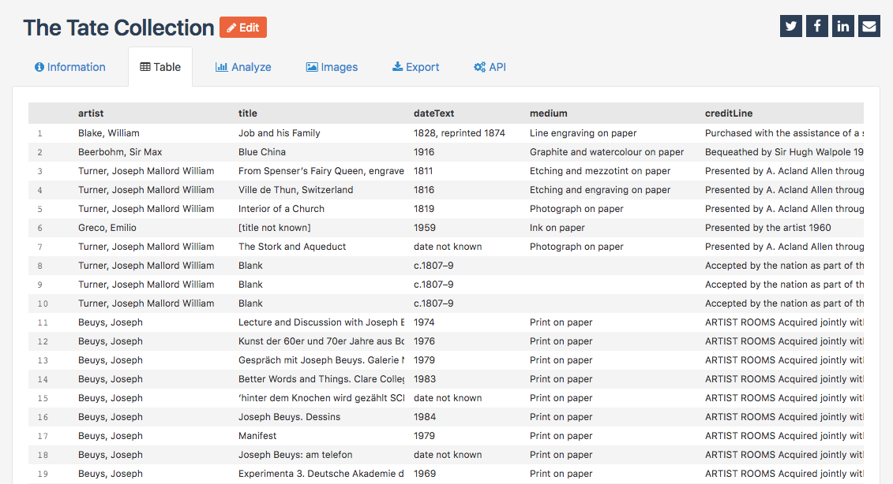

Sharing through social networks
===============================

.. admonition:: Important
   :class: important

   Since shortcuts to social networks are an optional feature, they are not activated on every OpenDataSoft portal. The activation of shortcuts to social networks depends entirely on the portal administrators.

Shortcuts to social networks are displayed above datasets, as well as a shortcut to the creation of an email, to be able to quickly share a dataset and more specifically the visualization currently displayed on the webpage.

The social networks available are:

- Twitter, which is represented by the |icon-twitter| button
- Facebook, which is represented by the |icon-facebook| button
- Linkedin, which is represented by the |icon-linkedin| button

Click on any of the social networks button to share the dataset and its visualizations with the chosen social network. Authentication, if not already done, is required.

To create an email that will contain a link to the dataset and its visualizations, click the |icon-mail| button.

