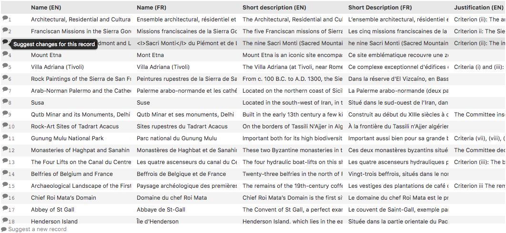

Submitting feedback
===================

.. admonition:: Important
   :class: important

   Since feedbacks are an optional feature, they are not activated on every OpenDataSoft portal. The activation of feedbacks depends entirely on the portal administrators.

Feedbacks are suggestions of improvement that users can send to portal administrators, through the Table visualization tab of a published dataset. The feedbacks can either be on an existing record, or to request the addition of a new record in the dataset.

To suggest improvements on an existing record:

1. Go to the Table tab of the chosen dataset.
2. Click on |icon-feedback| on the left of the record that could be improved/modified. A "Send feedback" window opens.
3. In the "Your comments" textbox, write your comments on the dataset record.
4. (optional) Click on "Suggest new values" to suggest specific values to replace the current ones.
5. At the bottom of the window, click on the Send your feedback button.

To request the addition of a new record:

1. Go to the Table tab of the chosen dataset.
2. At the bottom of the Table visualization, click on |icon-feedback| Suggest a new record.
3. In the "Your comments" textbox, write your comments about the requested dataset.
4. (optional) Click on "Suggest new values" to suggest specific values for the requested record.
5. At the bottom of the window, click on the Send your feedback button.

