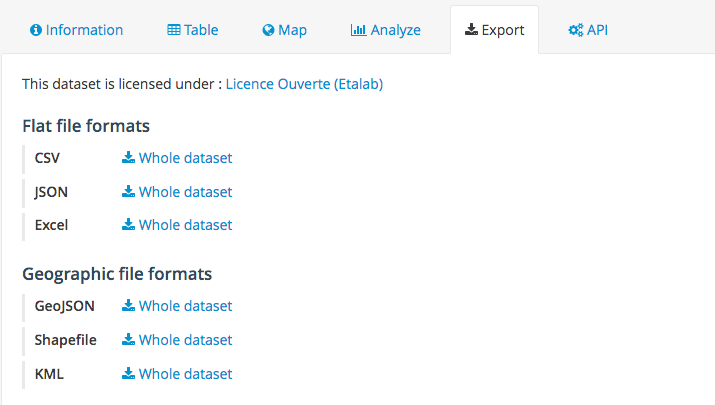

Exporting data
==============

OpenDataSoft lets you download datasets in various formats. CSV, JSON and Excel formats are always available, but depending on the nature of the data, more options can be available like GeoJSON or Shapefile if the dataset features a geoshape or geopoint field.

To export a dataset, go to the **Export** tab and choose the file format you want to download. If you selected filtering options, another option to download only the selected records will appear.

