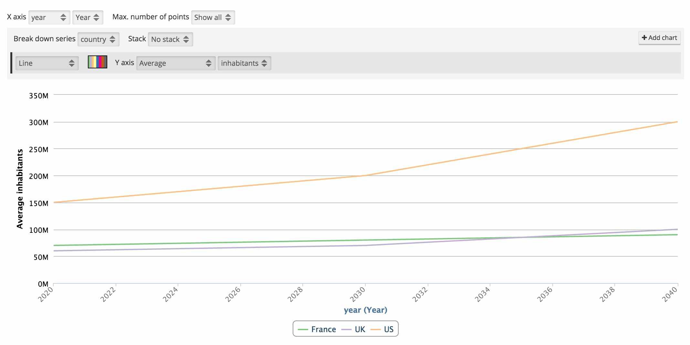

Frequently asked questions (FAQ)
================================

1. **What is OpenDataSoft?**

OpenDataSoft is a turnkey SaaS platform developed for business users to easily share, publish and reuse structured
datasets.

2. **Is OpenDataSoft open source?**

OpenDataSoft is not open source.

OpenDataSoft is selling a service, not a software. However, some parts of the stack are open source.

OpenDataSoft's front-end is open source. It is built and packaged as a set of AngularJS directives. This project can be accessed on `GitHub <https://github.com/opendatasoft/ods-widgets>`_ and comes with a full fledged documentation.

OpenDataSoft is also already contributing to the `Elasticsearch <http://www.elasticsearch.org/>`_ project by releasing in the public space a set of plugins that we have developed and that we use internally:

* `Hierarchical facets plugin <https://github.com/opendatasoft/elasticsearch-aggregation-pathhierarchy>`_
* `Geo aggregations plugin <https://github.com/opendatasoft/elasticsearch-plugin-geoshape>`_
* `Geo convex envelope plugin <https://github.com/opendatasoft/elasticsearch-aggregation-envelope>`_

3. **Is the OpenDataSoft team managing data on behalf of its customers?**

No.

OpenDataSoft sells a turnkey solution. Users manage their datasets on their domains by themselves. Of course, the OpenDataSoft support team is more than willing to help handling complex / specific data management issues.

Moreover, OpenDataSoft maintains a `data network <https://data.opendatasoft.com/>`_ which federates public datasets published by OpenDataSoft customers as well as datasets published by the OpenDataSoft staff.

4. **I'm representing a public administration. My country has already setup an Open Data initiative. Why should I have my own data portal?**

Open Data is about making data that has been produced by public administrations available to citizens. But most of the
time, one may want to go beyond the simple delivery of raw files and:

* Contextualize & increase the value of data
* Make data easy-to-understand for citizens
* Provide open services to an ecosystem of developers / reusers

To that extent, having a data management tool tailored to your needs is mandatory and keep in mind that thanks to the Open APIs provided by OpenDataSoft, your national Open Data portal will always have the possibility to reference your public datasets.

5. **If I publish datasets on OpenDataSoft, will they automatically be available to everyone on the Web?**

No.

The OpenDataSoft platform can be used for both public and private data management projects. A given platform can even
host public and private datasets. It is also possible to define the ACL of a recordset at the dataset level.

6. **What file formats are supported by OpenDataSoft?**

The OpenDataSoft platform natively supports the following file formats:

* ``CSV````
* ``GeoJSON``
* ``JSON``
* ``JSON lines``
* ``KML``
* ``OSM archives (OpenStreetMap)``
* ``Shapefile``
* ``MapInfo``
* ``Excel``
* ``OpenDocument Spreadsheet``
* ``Remotely stored files for any of the above formats (HTTP or FTP)``

Specific format parsers can also be made available by the OpenDataSoft team for specific requirements.

The OpenDataSoft platform is also able to connect to remote Web services. OpenDataSoft supports the following services in its standard version:

* ``ArcGIS REST API``
* ``RSS / Atom feeds``
* ``Salesforce / Force.com`` (you'll have to ask OpenDataSoft support to activate it on your domain)

Custom connectivity capabilities can be added upon request.

7. **What metadata standards does OpenDataSoft support?**

OpenDataSoft natively uses a subset of `DCAT <http://www.w3.org/TR/vocab-dcat/>`_ to describe datasets. The following
metadata are available by default:

* ``title``
* ``description``
* ``language``
* ``theme``
* ``keyword``
* ``license``
* ``publisher``
* ``reference``

It is possible to activate the full DCAT template, thus adding the following additional metadata:

* ``created``
* ``issued``
* ``creator``
* ``contributor``
* ``accrual periodicity``
* ``spatial``
* ``temporal``
* ``granularity``
* ``data quality``

A full `INSPIRE <http://inspire.ec.europa.eu/index.cfm/pageid/101>`_ template is also available and can be activated on
demand.

The metadata template can be customized (adding custom metadata). To do so, simply issue a support request from your OpenDataSoft's back-office.

8. **How many datasets can I create?**

You can create as many datasets as you want within the limit set in your licensing plan.

9. **How could I modify the look & feel of my OpenDataSoft domain?**

As a domain administrator, you can fully customize the styling of your portal. Logos, pictos, colors, styles as well as the header, the footer and the dataset box layout in the catalog page can be fully customized.

10. **How can other people collaborate on dataset configuration?**

Use the security section in your dataset's configuration page in OpenDataSoft's back-office to give other users or groups of users a write access to the dataset. These users should also have access to your domain to access your dataset. If this is not the case already, you should contact your domain administrator.

11. **How can I transform and enrich my datasets?**

A rich set of processing features is made available in the publishing console. Simply hit the **Add Processor** button.

12. **Can I geocode a full-text address?**

Yes.

OpenDataSoft supports Google and ESRI geocoding services. However, OpenDataSoft doesn't come with geocoding API keys.
The domain administrator has to configure a geocoding API key for one of these services in the back-office configuration (*Configuration > Data processing*).

13. **I have geocoded data in my dataset but the map view doesn't display anything. What went wrong?**

Remember that you dataset must contain at least a field of type **Geo Point** or **Geo Shape**

* Geo Point: ``latitude,longitude`` in WGS84, e.g.: ``48.2567,3.7689``.
* Geo Shape: any valid Geo JSON geometry in WGS84

14. **What is a facet?**

Facets are the backbone of most of the features made available by the OpenDataSoft platform. A facet is simply a field
which has been given specific filtering and aggregation capabilities.

.. image:: faq__facet-configuration--en.jpg
    :alt: Facet configuration

In the example above, the fields **country** and **year** have been defined as facets (notice the filter button next to
the type select).

Facets can be seen as dimensions of a dataset. Facets can be defined on the following field types:

* ``date``
* ``datetime``
* ``text``
* ``int``
* ``decimal``

Facets shall only be configured for fields that have a small number of different values compared to the number of
records in a dataset. For instance, defining a facet on an field that would uniquely identify a record is useless as
filtering on this field wouldn't bring any added value.

Facets are then used in a couple of places.

You can first use them to filter dataset records in the explore console.

.. image:: faq__facet-explore--en.png
    :alt: Refine on facets

As dimensions, facets support aggregations. You can thus use them to build advanced charts, as in the example below.




15. **I have an OpenDataSoft free trial account, how can I get a premium account?**

Please send a message to <contact@opendatasoft.com>.

We will be happy to discuss your needs and to propose you one of our plans.

16. **How can I display points on a map?**

For a geo data visualization to be available, your dataset needs to contain a **Geo Point 2D** field with content in
the ``latitude,longitude`` format. For instance: ``48.2567,3.7689``.

17. **In the table view, I have not been able to sort the results using a specific field? What went wrong?**

By default, only the numerical fields are sortable. That is, fields having one of the following types:

* ``int``
* ``double``
* ``date``
* ``datetime``

**Text** fields are not sortable by default. The dataset owner may configure some text fields to be sortable. Sortable **text** fields can be identified through the API (``sortable`` annotation).

18. **I published a dataset, but no category is displayed in the left column. What shall I do?**

Categories (facets) are built out of fields which have been defined as a **facet**. To set a field as a facet, simply
click on the **filter** icon, in the field definition header in the publishing console.

18. **When I go to the analyze view, the displayed chart doesn't make any sense. How could I change this?**

The dataset owner can easily define the default analytical representation of the dataset using the **analyze tab** in
the publishing console. End-users can also simply choose different settings and build their own analytical data
visualization using the available controls.

19. **How can I embed a data visualization on my website?**

There are three ways to embed OpenDataSoft's data visualizations on a website or any content management system:

* Copy-paste the embed code that can directly be found on the OpenDataSoft platform (usually located under the data
  visualization itself).
* Use `ODS Widgets, our open source widget library <https://github.com/opendatasoft/ods-widgets>`_
  to build content pages tailored to your needs with one or several data visualizations at once.
* Use OpenDataSoft's HTTP/REST APIs to develop your own embed.

20. **What is "Cartograph"?**

Cartograph is a tool developed by OpenDataSoft to make it possible to build geo mashups out of datasets stored on the
OpenDataSoft platform.

21. **What does API mean?**

API is an acronym for Applications Programming Interface. An API is a set of methods for computer programs to exchange information in an autonomous way. OpenDataSoft APIs allow for remote access to datasets using the HTTP protocol.

22. **What are APIs made for?**

APIs are a set of tools that developers can use to integrate data in their applications (Web applications, mobile
applications, business applications...).

23. **How many API calls can I perform?**

API endpoints are associated with quotas. OpenDataSoft customers can configure their own quotas policy. Contact your
OpenDataSoft domain owner for more details.

24. **Does every dataset have its own APIs?**

Yes.

Whenever you publish a dataset, a dedicated API is created. See :doc:`APIs documentation<exploring_catalog_and_datasets/04_sharing_and_reusing_data/using_api>` for more information.

25. **What are the compatible browsers for OpenDataSoft's platform?**

.. tabularcolumns:: |C|C|C|C|

+---------+--------------------+------------------+------------------+
| OS      | Browser            | Front Office     | Back Office      |
+=========+====================+==================+==================+
| Windows | Internet Explorer  |                  |                  |
|         |    |iexplore|      | Version 9+       | Version 10+      |
|         +--------------------+------------------+------------------+
|         | Edge               |                  |                  |
|         |    |iexplore|      | Latest version   | Latest version   |
|         +--------------------+------------------+------------------+
|         | Chrome             |                  |                  |
|         |    |chrome|        | Latest version   | Latest version   |
|         +--------------------+------------------+------------------+
|         | Firefox            |                  |                  |
|         |    |firefox|       | Latest version   | Latest version   |
+---------+--------------------+------------------+------------------+
| Mac     | Safari             |                  |                  |
|         |    |safari|        | Version 6+       | Version 6+       |
|         +--------------------+------------------+------------------+
|         | Chrome             |                  |                  |
|         |    |chrome|        | Latest version   | Latest version   |
|         +--------------------+------------------+------------------+
|         | Firefox            |                  |                  |
|         |    |firefox|       | Latest version   | Latest version   |
+---------+--------------------+------------------+------------------+

.. |iexplore| image:: browser-logos-master/src/edge/edge_32x32.png
    :alt: Internet Explorer

.. |chrome| image:: browser-logos-master/src/chrome/chrome_32x32.png
    :alt: Chrome

.. |firefox| image:: browser-logos-master/src/firefox/firefox_32x32.png
    :alt: Firefox

.. |safari| image:: browser-logos-master/src/safari/safari_32x32.png
    :alt: Safari
