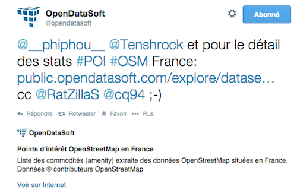

Configuring Twitter Cards
=========================

If you are a Twitter user, you may have seen a little summary appear below some links that you wrote
in tweets; this summary is a **Twitter Card**, a feature provided by Twitter itself that allows website
owners to configure how they want their content to be previewed in Twitter.

OpenDataSoft allows you to configure Twitter Cards for your datasets, so that if someone tweets a link
to a dataset on your portal, a summary is displayed (title and description of your dataset), associated
to a Twitter account of your choice.

How to configure
----------------

First, if you want your Twitter Cards to be associated to a Twitter account, you can go on your **Domain**
page, into the **Integrations** section, and fill in your Twitter account (don't forget to prefix it
with a @).

Go on the Twitter Card page available here: 
`<https://cards-dev.twitter.com/validator](https://cards-dev.twitter.com/validator>`_

You will be prompted to enter a "Card URL", which is the URL of the type of content you want a card for;
in this case, this is the URL to a dataset page (such as 
`<http://public.opendatasoft.com/explore/dataset/hurricane-tracks-1851-20071/>`_.

You can then hit the "Preview card" button and see what the card will look like. If you are happy with the result,
you can submit a "Request Approval" using the available button. Twitter will then review your application
and approve or refuse your request.
