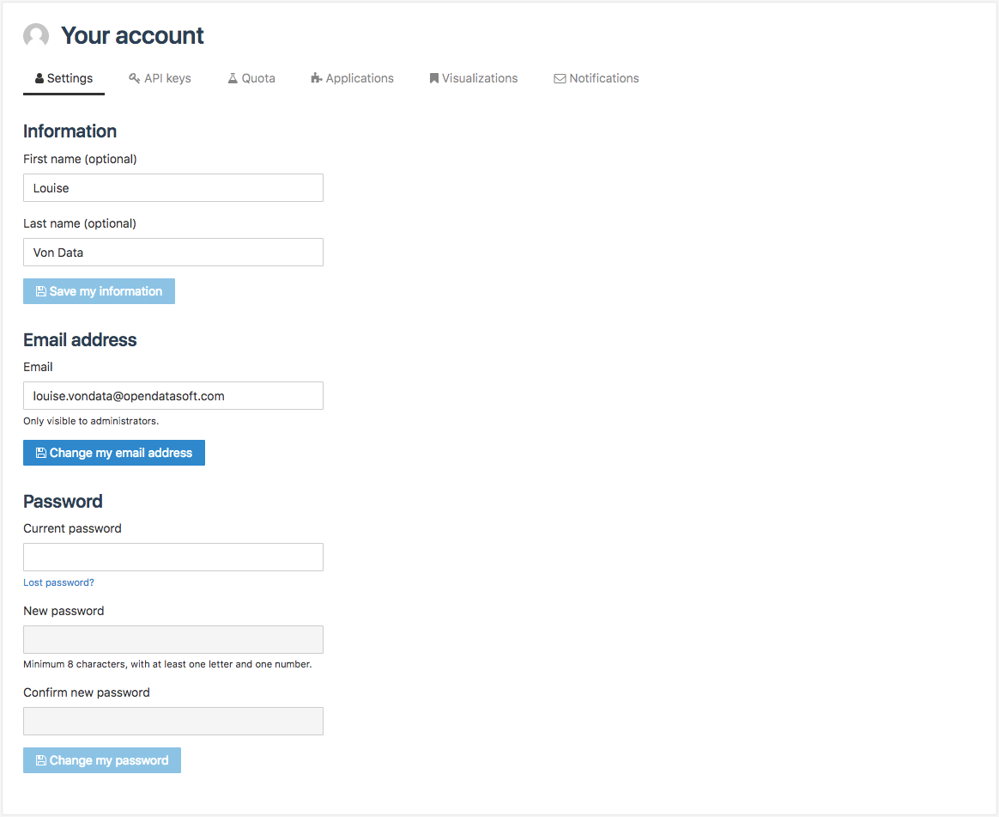

Configuring account settings
============================

From the Settings tab of their account, authenticated and logged in users have the possibility to modify their name, email address and password.

Modifying first and last name
-----------------------------

1. Click on your user name displayed at the top right corner, to access your account.
2. Click on the Settings tab.
3. (optional) In the Information area, write the new first name in the related textbox.
4. (optional) Still in the Information area, write a new last name in the related textbox.
5. Click on the Save my information button.

Modifying email address
-----------------------

1. Click on your user name displayed at the top right corner, to access your account.
2. Click on the Settings tab.
3. In the Email address area, write the new email address in the related textbox.
4. Click on the Change my email address button.

Modifying password
------------------

1. Click on your user name displayed at the top right corner, to access your account.
2. Click on the Settings tab.
3. In the Password area, write the current password in the related textbox.
4. Still in the Password area, write the new password in the related textbox.
5. Still in the Password area, confirm the new password in the related textbox.
6. Click on the Change my password button.
