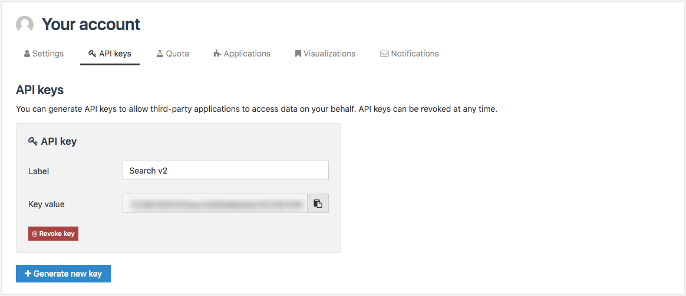

Generating an API key
=====================

From the API keys tab of their account, authenticated users have the possibility to generate API keys, as well as to manage them.

.. admonition:: Important
   :class: important

   API keys are bound to a specific domain. They only work on the domain on which they were created.

These API keys allow you to use the following APIs: ODS Search API v1 and v2, OData, WFS, and CSW (more info in the :doc:`Using APIs </exploring_catalog_and_datasets/04_getting_involved/using_api>` documentation).

Click |icon-copypaste| to copy an API key.

Generating an API key
---------------------

1. Click on the Generate new key button. An API key card appears on the tab.
2. Write a name for the API key in the Label textbox. It should indicate the purpose of the API key.

Revoking an existing API key
----------------------------

1. Click on the Revoke key button at the bottom of the chosen API key card. A pop-up window appears.
2. Click on the Revoke key button to confirm the revocation of the API key.

