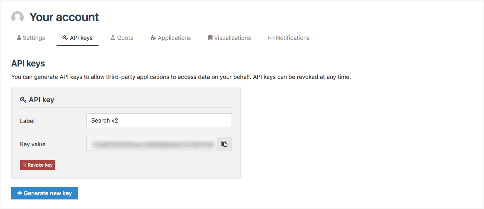

Managing API keys
=================

After authenticating to a portal, you can generate API keys and manage them from the API keys tab of your account.

API keys are bound to a specific domain. They only work on the domain on which they were created.

These API keys allow you to use the following APIs: ODS Search API v1 and v2, OData, WFS, and CSW. For more info, see :doc:`Using APIs </exploring_catalog_and_datasets/04_getting_involved/using_api>`.

.. admonition:: Important
   :class: important

   API keys inherit all permissions granted to the user for which it has been created.
   That's why you should be cautious with how they use API keys.
   
   If you observe unauthorized usage of your API key, if your API key gets exposed or is unused, it is recommended to revoke it and create a new one.

Generating an API key
---------------------

Generate an API key to make authenticated API calls.

1. Log in to the portal.
2. In the top right corner, click your user name.
3. From the **Your account** page, click the **API keys** tab.
4. Click on the **Generate new key** button. An API key card appears on the tab.
5. Enter a name for the API key in the **Label** field. It should indicate the purpose of the API key.

The API key is created. You can click |icon-copypaste| to copy it.

Revoking an existing API key
----------------------------

Revoke compromised or unused API keys.

1. Log in to the portal.
2. In the top right corner, click your user name.
3. From the **Your account** page, click the **API keys** tab.

4. Click on the **Revoke key** button at the bottom of the desired API key card.
5. In the dialog box that appears, click on the **Revoke key** button to confirm the revocation of the API key.

