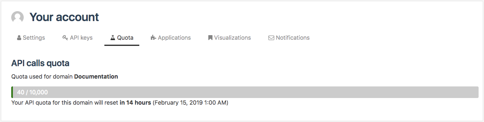

Checking account quota
======================

From the Quota tab of their account, authenticated users have the possibility to check how many API calls they have made compared to how many they are allowed. This allowed quota is defined per user by the portal administrators.

These quotas are daily: they are reset every day at 00:00 UTC.

