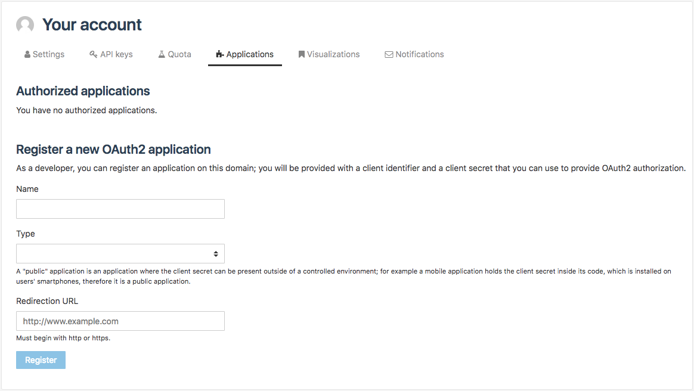

Registering applications
========================

From the Applications tab, authenticated users have the possibility to see the list of registered applications as well as to register new OAuth2 applications (more information on OAuth2 in the `Search API documentation <https://help.opendatasoft.com/apis/ods-search-v2/#using-oauth2-authorization>`_)

To register a new application:

1. In the Register a new OAuth2 application area, write the name of the application in the Name textbox.
2. Still in the Register a new OAuth2 application area, select an application type from the drop-down selection: Public or Confidential.
3. Still in the Register a new OAuth2 application area, enter the redirection URL in the related textbox.
4. Click on the Register button.

Once registered, the application is listed in the Authorized applications area of the Applications tab.
