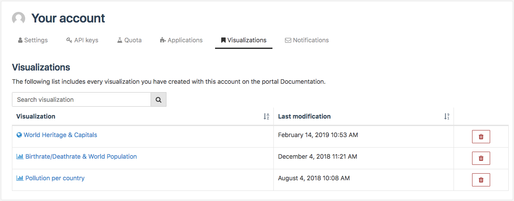

Managing saved visualizations
=============================

From the Visualizations tab, authenticated users can see the list of visualizations created with either the Map Builder or the Chart Builder and that they have saved.

All saved visualizations are listed in a three-column table:

- The Visualization column contains the name of the visualization. The name is preceded by an icon that indicates whether the visualization is a map (|icon-map|) or a chart (|icon-chart|).
- The Last modification column contains the date of the last modification of the visualization.
- The last column contains a |icon-delete| button to delete a saved visualization.

.. admonition:: Note
   :class: note

   Use the search bar above the table to search for a specific visualization instead of scrolling down that table.

Editing a saved visualization
-----------------------------

1. In the Visualization column of the saved visualizations table, click on the name of the visualization to edit.
2. Edit the visualization in the Map Builder or the Chart Builder.
3. Save the visualization again. The last modification date in the saved visualizations table automatically updates.

Deleting a saved visualization
------------------------------

1. In the last column of the saved visualizations table, click on the |icon-delete| button of the visualization to delete. A confirmation window appears.
2. Click on "Yes, delete chart/map!" to confirm the deletion.

