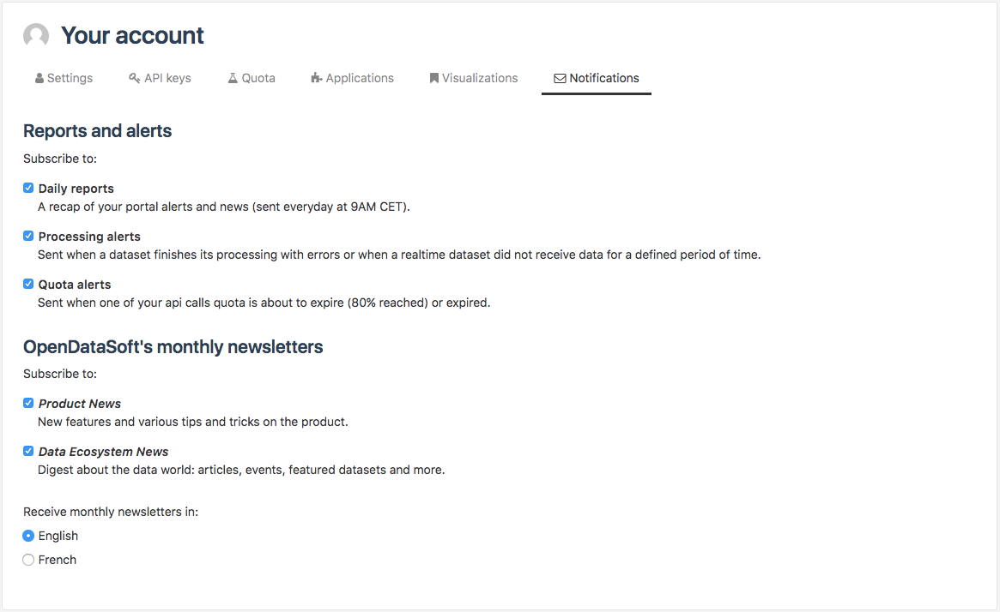

Managing notifications
======================

From the Notifications tab, authenticated users can manage which domain-related notifications and Opendatasoft-related newsletters they wish to receive by email.

.. admonition:: Prerequisite
   :class: important

   Notifications are sent to the users depending on their permissions.

.. admonition:: Note
   :class: note

   Notifications are always sent by support@opendatasoft.com. For notifications to be sent from a different sender address, for example, the email address of an organization, please contact the support team.

Subscribing to alerts and reports
---------------------------------

Alerts and reports notifications are sent whenever an important event occurs on the portal. They allow being informed in real time and take action if needed.

3 types of domain-related notifications can be sent:

- Daily reports: portal alerts and news sent daily at 9 AM. They notify users about processing alerts, newly created datasets on the portal, and pending user feedbacks on a dataset (:doc:`more information<daily_report>`).
- Processing alerts: sent whenever there is a processing alert on a newly created dataset. They notify about processors in error and errors of realtime dataset update (:doc:`more information<processing_alert>`).
- Quota alerts: sent when a quota has reached 80% or is expired (:doc:`more information<quota>`).

Tick the box corresponding to any of the Notifications to subscribe. Untick any of the boxes to stop receiving the corresponding notification.

.. toctree::
   :hidden:

   daily_report
   processing_alert
   quota

Subscribing to Opendatasoft newsletters
---------------------------------------

2 types of newsletters can be sent:

- Product News: informs about new features, shares tips and tricks about the Opendatasoft platform.
- Data Ecosystem News: informs about the data world (articles, events, featured datasets, etc.).

Tick the box corresponding to any of the newsletters to subscribe. Untick any of the boxes to stop receiving the corresponding newsletter.

.. admonition:: Note
   :class: note

   Opendatasoft newsletters are only available in English and French.
