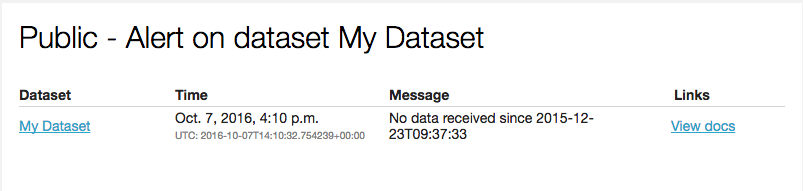

Dataset processing notifications
--------------------------------

The following events trigger a dataset processing notification:

- A realtime dataset did not receive data for a period of time (the period can be configured on each dataset)
- A dataset finished its processing with errors

Recipients
~~~~~~~~~~

- Users on the domain with the "Edit all datasets" permission
- Users on the dataset's security list with the "Edit all datasets" permission

Sample
~~~~~~

