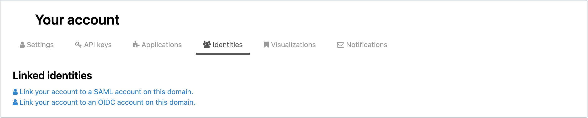
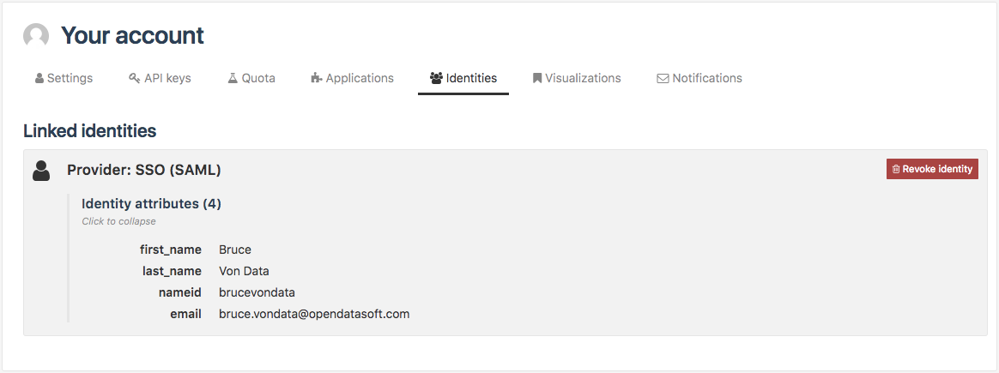

Managing identities
===================

.. admonition:: Prerequisite
   :class: important

   The Identities tab is only available if SAML is activated on the portal.

From the Identities tab, authenticated users have the possibility to manage their SAML identities or to link their OpenDataSoft account to a SAML identity.

The content of the Identities tab depends on the type of the user. There are 3 types of users in OpenDataSoft: OpenDataSoft users, local users and linked users (more information in :doc:`the SAML documentation </configuring_domain/01_managing_security/saml>`).

Identities tab for OpenDataSoft users
-------------------------------------

For OpenDataSoft users, the Identities tab only contains a link that allows OpenDataSoft users to link their OpenDataSoft account to a SAML identity. It makes them become linked users, which changes the content of the Identity tab.

To link the account to a SAML account, click the "Link your account to a SAML account on this domain" link.

Identities tab for local and linked users
-----------------------------------------

For both local and linked users, the Identities tab contains information about the SAML identity. Each SAML identity is represented by a rectangle which contains all identity attributes sent by the identity provider.

For linked users only, a "Revoke" button is also displayed at the top right corner of the SAML identity rectangle. It allows to revoke the SAML identity without deleting the OpenDataSoft account: it makes the linked users become OpenDataSoft users.

To revoke a SAML identity:

1. Click on the Revoke button. A confirmation pop up window appears.
2. Click on the OK button to confirm.
