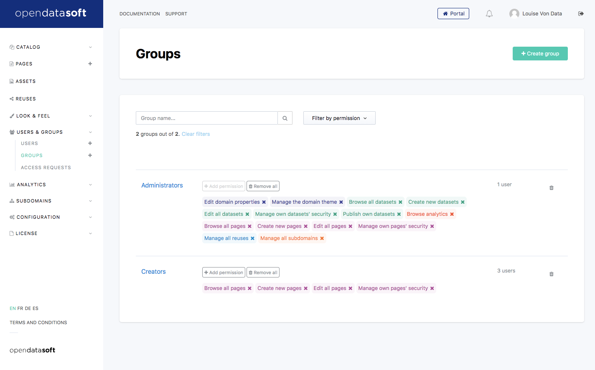
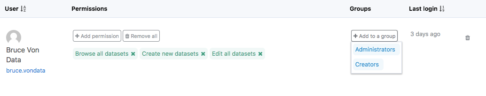
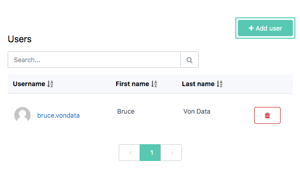
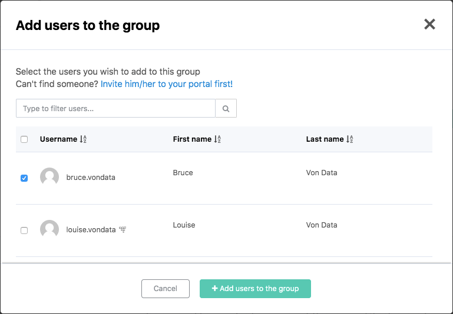

Organizing groups
=================

Setting permissions and quotas at the user level provides the most control over security but can also become tedious
for large amount of users. In this case, you'll probably want to set up groups.

Granting permissions and quotas
-------------------------------

Groups are a simple way to share security settings between users. As for a user, a group can have permissions and
quotas. Group members then inherit from the group's settings:

* A user's **permissions** is therefore defined as the union of its own permissions and of all permissions granted
  through the groups he/she is a member of.
* A user's **quotas** (if he/she doesn't have his/her own settings) is the maximum of all of his/her groups values.

Managing members
----------------

There are three ways to add or remove members to a group.

In the case of a single user, you can look him/her up on :doc:`the users index page <users>` and directly from there
add him/her to any group. Just click on the *add group* button and select the group within the dropdown list.

This is of course a handy shortcut and you can also access the user's page directly and from there add him/her to any
group.

If you want to add multiple users at once to a group though, you should go to the group's page and from there click the
*add user* button.

This will bring up a list of all of your portal's users. Select the ones you're interested in, click the
*add users to the group* button and you're done!

.. admonition:: Note
   :class: note

   Adding members to a group from the group's page is a direct action that doesn't require a save. When the modal window closes, the selected users will have become group members.
