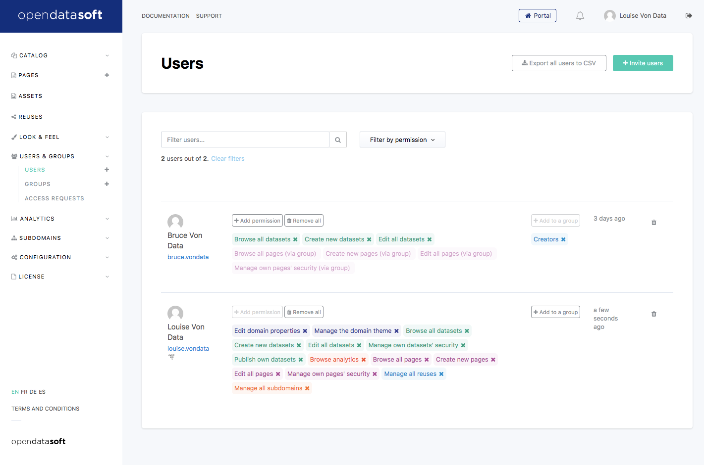
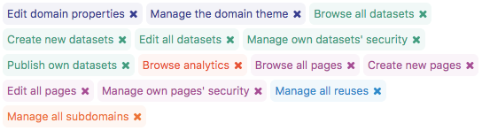
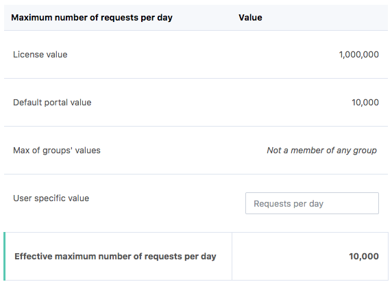

Managing users
==============

Now that you've set up your :doc:`portal's security policy </configuring_domain/01_managing_security/portal>`, people are registering and becoming full-fledged
users. Unless your portal is closed to anonymous users, this new status is not changing anything for them. They can
still see the same data and a subject to the same quotas as before.

Permissions
-----------

What is changing is that you can now give them permissions to extendin what they can do. You can do so either on the
users' index page or directly on the single user management page, both accessible through the
**Users & groups / Users** section in your back office.

Permissions each affect an independent part of your portal so that by looking at a user's permissions list, you know
what they can do. Each permission has its own category, symbolized by an icon and a tag color.

.. admonition:: Important
   :class: important

   Authenticated users can manage and generate API keys.
   API keys inherit all permissions granted to the user for which it has been created.
   That's why administrators should be cautious with the permissions they grant to users.

   Administrators cannot revoke users' API keys.
   If you observe unauthorized usage of an API key, if an API key gets exposed or is unused, it is recommended to ask users to revoke the API key and create a new one.

Dataset permissions
~~~~~~~~~~~~~~~~~~~

.. list-table::
   :header-rows: 1

   * * Permission
     * Description
   * * Browse all datasets
     * The user may access all data on all published datasets, regardless of any security parameters set for this user or the datasets (for example, the user can access all restricted datasets).
       This permission on its own doesn't grant access to the back office.
   * * Create new datasets
     * The user may create new datasets (but not publish them, to do so, the Publish own datasets permission is required), within limits defined by the quotas.
       **This permission grants access to the Catalog section of the back office.**
   * * Edit all datasets
     * The user may edit all existing datasets.
       **This permission grants access to the Catalog section of the back office.**
   * * Manage own datasets' security
     * The user may manage security options and parameters (users able to access the datasets, visible records, etc.) for the datasets they have permission to edit.
       This permission on its own doesn't grant access to the back office.
   * * Publish own datasets
     * The user can publish or republish the datasets they have the permission to edit.
       This permission on its own doesn't grant access to the back office.

These are general permissions that apply to a user with regard to the portal, but a user can also get
:doc:`permissions for individual datasets </publishing_data/09_managing_dataset_security/security>`.

Page permissions
~~~~~~~~~~~~~~~~

.. list-table::
   :header-rows: 1

   * * Permission
     * Description
   * * Create new pages
     * The user may create new pages.

       **This permission grants access to the Pages section of the back office.** It also allows to manage assets.
   * * Edit all pages
     * The user may edit and delete all existing pages.

       **This permission grants access to the Pages section of the back office.** It also allows to manage assets.
   * * Browse all pages
     * The user may access all pages, regardless of any security parameters set for this user or the pages (for example, the user can access all private pages).
       This permission on its own doesn't grant access to the back office.
   * * Manage own page's security
     * The user may manage security options and parameters (:doc:`access policy, page-level permissions on defined users and groups</creating_content/02_managing_page_security/managing_page_security>`) for the pages they have the permission to edit.
       This permission on its own doesn't grant access to the back office.

Other permissions
~~~~~~~~~~~~~~~~~

.. list-table::
   :header-rows: 1

   * * Permission
     * Description
   * * Edit domain properties
     * The user may configure all options and parameters in the Assets, Look & feel (except for the Theme subsection), Users & groups, and Configuration sections of the back office.

       **This permission grants access to the Assets, Look & feel (Branding, Data visualizations, Navigation and Dataset themes), Users & groups, Configuration and License sections of the back office.**
   * * Manage the domain theme
     * The user may configure all options and parameters in the Theme and Dataset themes subsections of the Look & feel section of the back office. To access the other subsections (Branding, Data visualizations, and Navigation), the Edit domain properties permission is required.

       **This permission grants access to the Look & feel (Theme) section of the back office.** It also allows to manage assets.
   * * Browse analytics
     * The user may access all analytics dashboards, both at the domain level and at the dataset level.

       **This permission grants access to the Analytics section of the back office.**
   * * Manage all reuses
     * The user may see, approve, reject, and delete all reuse submissions on the portal.

       **This permission grants access to the Reuses section of the back office.**
   * * Manage all subdomains
     * The user may edit, create, and delete all subdomains (:doc:`if subdomains are enabled on the portal </managing_domain/02_managing_subdomains/index>`).

       **This permission grants access to the Subdomain section of the back office.**

Quotas
------

In order to avoid having a user use up all of your license usage quotas, you can
:doc:`set up default quotas for users </managing_domain/04_monitoring_license_and_quotas/quotas>`. However, you can override the general quotas given to everybody with
specific values tailored to a single profile for each of the 3 quota types.

Since quotas can also be defined at the group level, users are inheriting from 3 settings.

* license quotas (for the whole portal)
* default quotas (for each user indifferently)
* group quotas (for each member)

The value that applies to the given is calculated as such:

* If there is a specific value for the user, this value applies.
* If there is no specific value for the user, but the user is a member of at least one group with a specific value, then
  the maximum of all group values apply.
* If there no specific value and no group value, then the default security value for non-anonymous users applies.

The applied values are then capped at the license value.

Since this is a bit difficult to remember, the interface includes a calculator showing you the license, default, and
group values and dynamically computes the effective quota depending on the specific value you're setting up.

