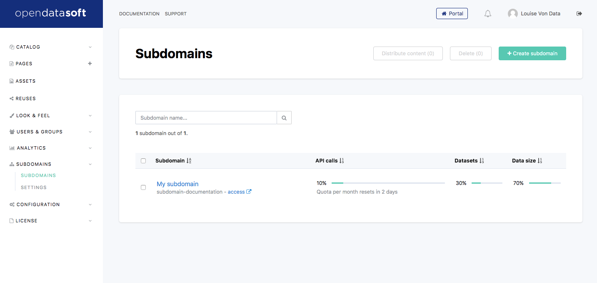

Creating a new subdomain
========================

Subdomains management is granted to users which have the *Manage all subdomains* permission. This permission can be given to any user by the portal administrators (those users having the *Edit domain properties* permission).

Users with this permission will see a *Subdomains* menu in the left control pane. Simply click this menu item to access the subdomains management section.

The maximum number of subdomains you can create is limited and depends on your Opendatasoft's contract.

To create a new subdomain, click the *Add subdomain* link in the menu, or click the *Create subdomain* button on the Subdomain's list page.

You will be prompted a form to create your new subdomain, with the following fields:

* **Subdomain name**: the name of the subdomain, which will appear for example in emails. This can be changed later by the subdomain's administrator.

* **Subdomain identifier**: the identifier of your subdomain.

  The real address of your domain will thus be: <Subdomain Identifier>-<Domain Identifier>.opendatasoft.com. For instance, if you own an Opendatasoft domain named **mydomain** (that can be accessed at **mydomain.opendatasoft.com**) and if you create a subdomain named **test**, the subdomain full address will be: **test-mydomain.opendatasoft.com**.

  Of course, like with domains, you can contact the Opendatasoft's support to get your subdomains DNS customized, see :doc:`Customizing your domain URL</configuring_domain/06_customizing_domain_url/custom_urls>` for more details.

* **Administrator's email address**: the email address of the subdomain administrator.

  This email address does not have to belong to a user already having an Opendatasoft account. In which case, the Opendatasoft platform will automatically initiate the account creation procedure.

  The owner is granted full administrative privilege over the newly created subdomain.

You will also be able to pre-configure :doc:`distribution parameters, distributed content and datasets </managing_domain/02_managing_subdomains/distribute>`,
and :doc:`usage limits </managing_domain/02_managing_subdomains/quotas>`, as described in their respective documentation.

Once created, the subdomain appears in the subdomains list, along with some information related to its current quotas.
