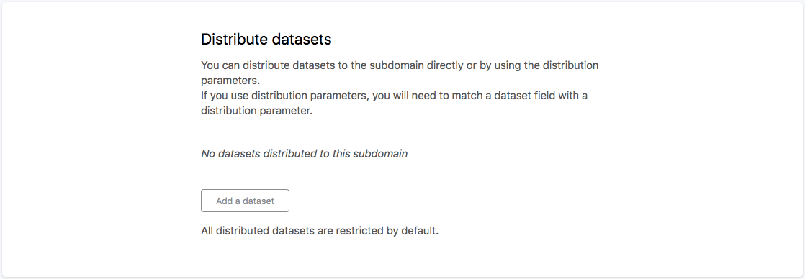
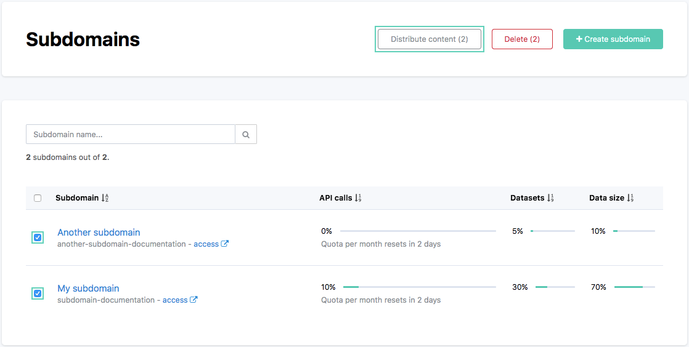
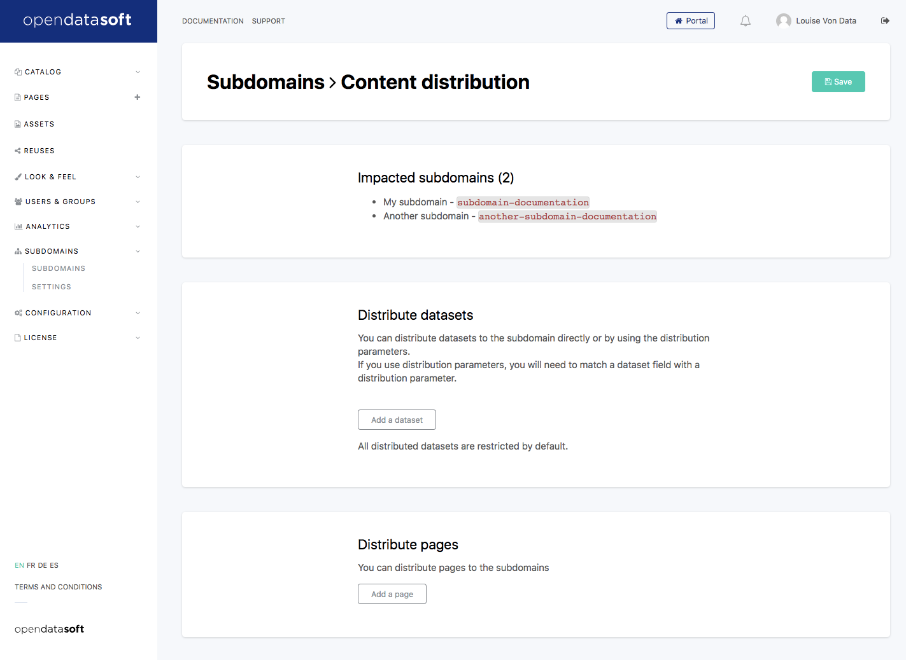
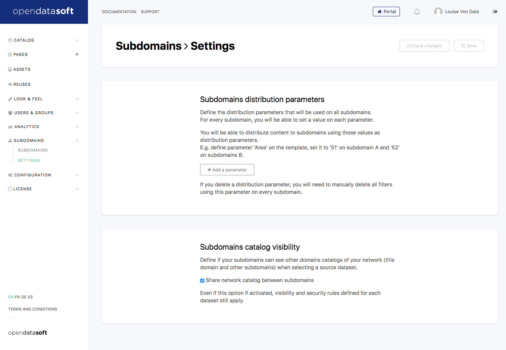
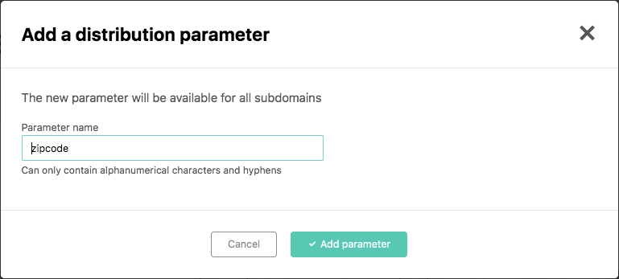
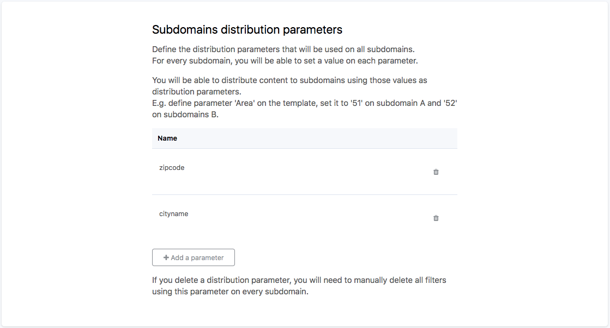
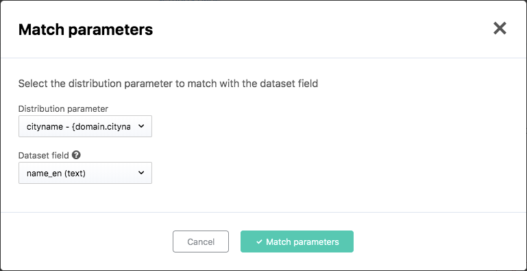
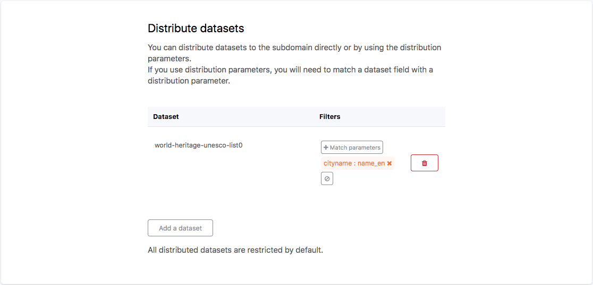

Distributing content to subdomains
==================================

As a "parent" domain, you can choose to distribute specific pages and datasets to your subdomains. For example, you could:

- distribute a common homepage to your other business units
- distribute a part of a large dataset to subdomains you created for each of your customers
- distribute a dashboard, and at the same time, the datasets used for the dashboard

Distributing datasets to a subdomain
------------------------------------

From the subdomain's management page in the back office, you can find the *Distribute datasets* interface.
By default, nothing is distributed, so the list is empty.

Clicking on *Add a dataset* opens your domain's catalog, which allows you to find and select a dataset to distribute.

Once the dataset is selected, it appears in the distributed dataset list.

As soon as you save, the dataset will be distributed and available on the subdomain's catalog.

.. admonition:: Note
   :class: note

   From the subdomain, a distributed dataset acts just like a federated dataset: you can't edit its data (for example, you can't re-order fields or add processors), but you can override metadata, manage the security settings, set the dataset as restricted, filter the data for specific users or groups. The dataset may also be deleted from the subdomain.

At any time, you can cancel the distribution using the little icon on the right in the distributed datasets list. This will remove the dataset from the subdomain's catalog,
but it won't delete the dataset from the parent domain.

Distributing pages to a subdomain
---------------------------------

From the subdomain's management page in the back office, you can find the *Distribute pages* interface.
By default, nothing is distributed, so the list is empty.

Clicking on *Add a page* opens a list of your domain's pages, which allows you to select one or more pages to distribute.

Once selected, your pages will appear in the list.

Click on the *Save* button now, and the page will appear in the subdomain.

.. admonition:: Note
   :class: note

   A distributed page can't be edited from the subdomain because the page's content is entirely managed by the parent domain: if the content changes in the parent domain, it is immediately also changed in the subdomains. However, the subdomain can delete the page; it can also copy the page's content into a new page, which will be entirely editable like any normal page, but therefore won't automatically receive updates from the parent domain.

At any time, you can remove a distributed page using the little icon on the right of the page in the list. This will cancel the distribution to the subdomain but will not delete the page on the parent domain.

Distributing content to multiple subdomains
-------------------------------------------

From the subdomains list, you can select two or more subdomains and click on the *Distribute* button; this will bring you
to a dedicated content distribution page for these subdomains.

This new page will remind you of the impacted subdomains and let you select pages and datasets in an interface similar to the one for individual subdomains.

Organize your distribution using parameters
-------------------------------------------

If you have several subdomains, you may want to distribute pages and datasets slightly different for each. For example, maybe you want
to distribute a homepage containing "Welcome on [something]", or maybe you have a country-wide dataset, but you want to distribute
parts of it to regional subdomains.

As an administrator managing your subdomains, you can define "distribution parameters". You can then fill these parameters for each
subdomain. These parameters will then be available to change the distributed content depending on the subdomain.

For example, we'd like to prepare a homepage and a dataset for a few city portals. We want the homepage to contain the city
name and the dataset to be filtered on the ZIP Code.

First, we'll add two parameters for all our subdomains. This is managed from the subdomains' *Settings* page.

By clicking *Add a parameter*, we'll add two parameters, "zipcode" and "cityname".

Now, we can fill these parameters for each of our subdomains by clicking on the subdomain's name in the subdomains list to get to the
subdomain configuration page.

Then, we can create the content I want to distribute. First, we can do a homepage containing the city's name. In the page editor,
we can use :code:`{domain.cityname}` as a placeholder for the city name filled for that subdomain.

Now, we can distribute the homepage and the dataset using, for example, the multiple domain distribution page.

To distribute the homepage, we just add it to the list as usual.

To distribute the dataset, we add it to the list and then click *Match parameters*: this allows you to configure a filter on the
data depending on one of the distribution parameters. In our case, our dataset has a :code:`zipcode` field, and we match it with
the :code:`zipcode` parameter of our subdomains.

Our content distribution is ready.

Now, we just have to *Save* it. Each of our subdomains now has a dedicated homepage that they can use and the part of the dataset that matches their city!
