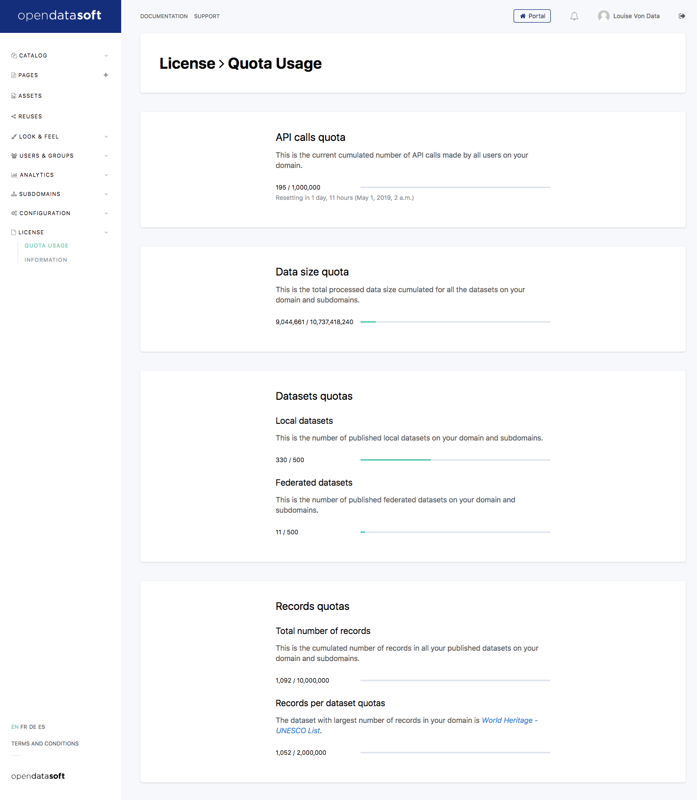

Quotas
======

Go to the *License > Quota usage* page.

This is the page where you can monitor your quota usage for the ongoing period.

You will find three usage indicators comparing the number of datasets, the number of records, and the number of API calls to the quotas defined in your license.

