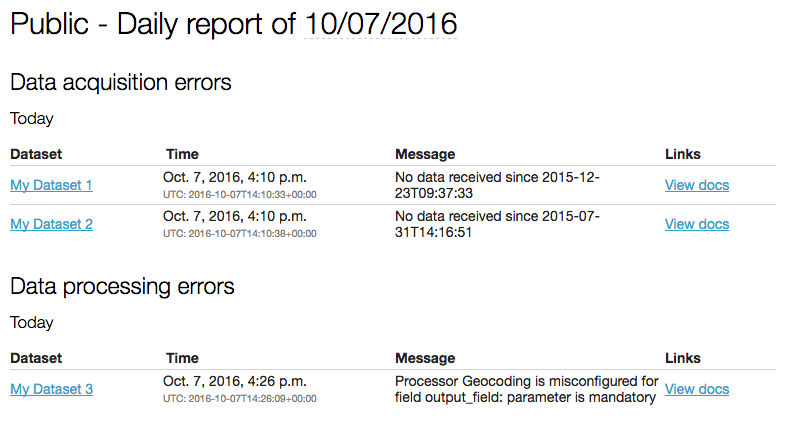

Daily report
------------

The daily report contains a recap of the portal's active issues:

- Open processing alerts for realtime datasets, i.e. no data received for a period of time
- Datasets currently in error due to a processing (scheduled or trigger)

They are sent every day at 9AM (CET).

Recipients
~~~~~~~~~~

- Users on the domain with the "Edit all datasets" permission

Sample
~~~~~~

