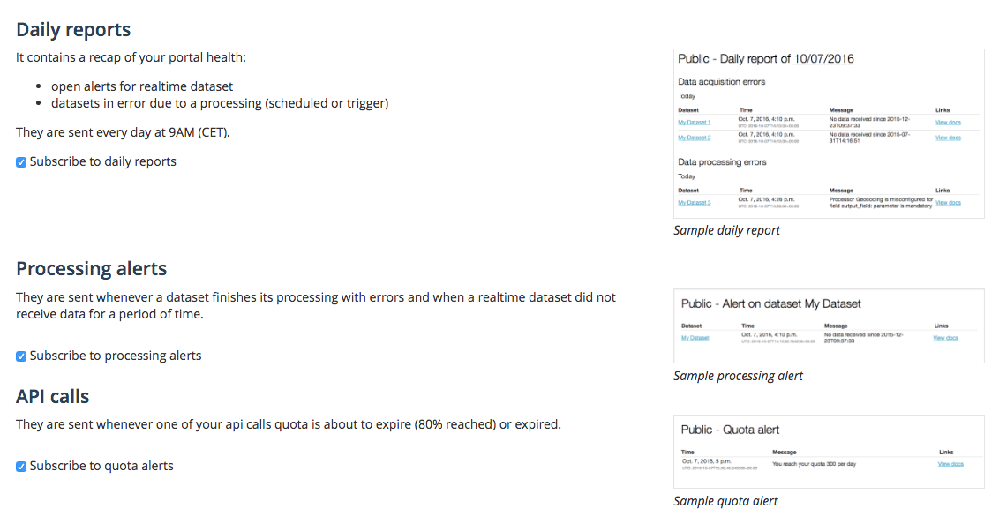

Notifications
=============

Notifications are sent whenever an important event occur on the portal. They give realtime information about the health of the portal.

They are sent by email, the default sender is support@opendatasoft.com, you can ask the support to change it.

It’s possible for users to unsubscribe to the different notification type on their account page.

We found the following notifications:

.. toctree::
   :maxdepth: 1

   quota
   processing_alert
   daily_report