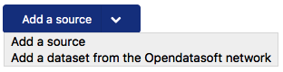
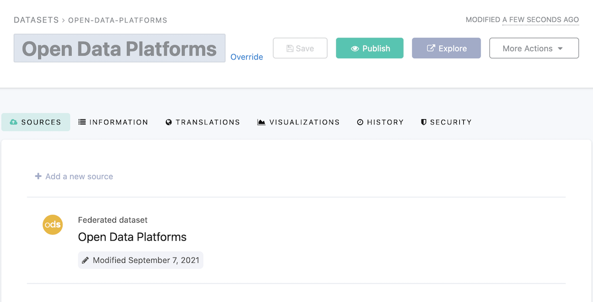

Federating data
===============

Federation is a core feature of the data network we are building. Using it is a good way to enrich your own data, and it also gives others a new way to discover and reuse them.

.. ifconfig:: language == 'en'

    .. image:: images/federation__introduction--en.png
        :alt: Federation simple schema

.. ifconfig:: language == 'fr'

    .. image:: images/federation__introduction--fr.png
        :alt: Schema fédération simple

Federation allows to redistribute an open dataset from your domain (Opendatasoft instance) or another domain in full or in part. It is a way to collect external sources of data on its own domain.

Source
------

To federate a dataset, go to the *Catalog > Dataset* page and hit **New dataset**. Then, hit the little arrow on the right side of the **Add a source** button.

There is then a link **Add a dataset from the Opendatasoft network**. It leads to a console from where it is possible to configure a new federated source.

Click on **Select a source dataset**.

.. image:: images/federation_sources.png

Different sources are available :

- The same domain
- All open datasets from every Opendatasoft domains
- Domain's subdomains (optional)

The next step is to either select a whole dataset or a part of it. The filters are the same as in the dataset explore console; there are pre-defined filters, a query box, and, if available, the geofilter.

Once the data is selected, the dataset appears in the back office like a normal one, except that there is no Processing tab. Indeed, the data is not duplicated, and it is not possible to transform it. Only the metadata and visualization configuration can be overridden.

Overriding metadata and visualizations
--------------------------------------

Both metadata and visualization can be overridden. To do so, hit **Override** and enter the desired value.
It is possible to come back to the original value by hitting **Return to original value**.

Limitations
-----------

The federation does not duplicate the data. Only the metadata and visualizations are duplicated; hence they can be overridden. There are two reasons for that:

- It is then possible to redistribute data without impacting the size of the data defined in the contract,
- When the data changes, the federated dataset is always up-to-date.

.. ifconfig:: language == 'en'

    .. image:: images/federation__explanation--en.png
        :alt: Federation schema

.. ifconfig:: language == 'fr'

    .. image:: images/federation__explanation--fr.png
        :alt: Schema fédération

.. important::
   Currently, the metadata of federated datasets are updated every day. However, other modifications on the original dataset (for example, visualizations configurations, dataset schema) will not trigger an automatic update: unpublishing and republishing the federated dataset is necessary for the latest modifications to be visible.
