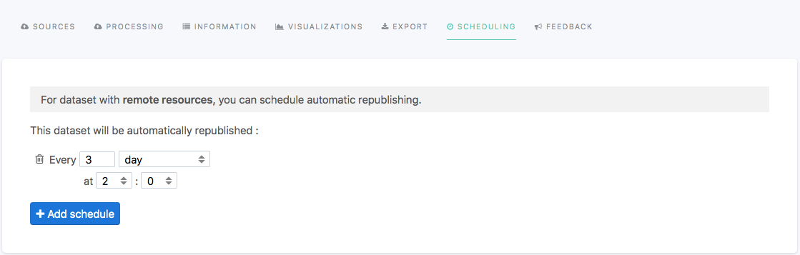

Keeping data up to date
=======================

The Opendatasoft platform makes it possible, in the very same data catalog, to handle completely static datasets (which need to be published only once) and live datasets (which need to be regularly updated).

Two different mechanisms are made available to handle datasets refresh:

- Scheduling consists of having a dataset being automatically republished at fixed intervals. This mode is most useful for datasets with a remote resource that is regularly updated.
- Pushing realtime data on the Opendatasoft platform using a dedicated API endpoint. This mode is most useful when the data can be sent directly by the system that produces the data points, such as a computer program sending event metrics or a set of sensors sending their readings.

Using scheduling to keep a dataset up to date
---------------------------------------------

.. admonition:: Note
    :class: note
 
    The availability of this feature depends on the license of the Opendatasoft domain.

Datasets can be automatically republished at fixed intervals.

This solution is the easiest to implement. It does not require any development, only a remote source and some settings in the dataset configuration.

Adding a remote source
~~~~~~~~~~~~~~~~~~~~~~~~~~~

To schedule a dataset, you need to add a remote source, specified as a URL (HTTP or FTP) to a file or configure a remote service.
For more information, see :doc:`../01_creating_a_dataset/retrieving_file` and :doc:`../01_creating_a_dataset/configuring_remote_service`.

Specifying scheduling interval
~~~~~~~~~~~~~~~~~~~~~~~~~~~~~~

Once you saved a dataset with a remote source, the **Scheduling** tab is activated:

From this tab, you can add as many schedules as you want.
For example, if it fits your needs, you could decide to schedule a dataset to be reprocessed every Monday morning and every Wednesday afternoon.

By default, the minimum scheduling interval is the day.
Please contact Opendatasoft's support if you need minute-level scheduling on your domain.

.. admonition:: Important
   :class: important

   Schedules are defined to run in the timezone of Paris, France:

   - In standard time, schedules run on GMT+1 (Central European Time).
   - In the summer months, schedules run on GMT+2 (Central European Summer Time).

Pushing realtime data
----------------------

.. admonition:: Note
   :class: note

   The availability of this feature depends on the license of the Opendatasoft domain.

For some types of data, it can be helpful to push data instead of the more traditional model of having the data being pulled from a resource by the platform.
To address this need, the Opendatasoft platform offers a realtime push API.

It is not to be confused with the ability to schedule a dataset processing. When scheduling, the dataset will periodically pull the resource and process the data inside it.
In contrast, with the push API, the dataset is fed by an application through a push API, and records are processed one by one as soon as they are received.

Configuring the dataset schema
~~~~~~~~~~~~~~~~~~~~~~~~~~~~~~

1. In **Catalog** > **Datasets**, click on the **New dataset** button.
2. In the wizard that opens, select **Realtime** under the **Configure a remote service** section.
3. In the **Real time data schema** box, enter some bootstrap data. The data should have all the fields that will be sent through the API.

.. admonition:: Note
   :class: note

   The bootstrap data is not used in the dataset: its sole purpose is to allow setting up the dataset.

4. Configure **Information** and **Alert Management** options.
5. Retrieve the push URL.

Using the push URL
~~~~~~~~~~~~~~~~~~

After configuring the realtime source parameters, a URL path containing a push API key appears.
This path, appended to your domain base URL, is where the platform will expect data to be sent after publication.

The data is expected to be sent in JSON format:
- As a single JSON object for a single record
- An array of JSON objects to push multiple records at once

A minimal example of the API usage for a dataset with a single field named ``message``, using curl, would be:

.. code-block:: bash

    curl -XPOST <DOMAIN_URL>/api/push/1.0/<DATASET_ID>/<RESOURCE_ID>/push/?pushkey=<PUSH_API_KEY> -d'{"message":"Hello World!"}'

Here is the resulting dataset:

.. image:: images/realtime__record--en.png
    :alt: table view with a single record with value "Hello World!" in the "message" field

A minimal example with the same dataset, using the array form to send multiple records at once would be

.. code-block:: bash

    curl -XPOST <DOMAIN_URL>/api/push/1.0/<DATASET_ID>/<RESOURCE_ID>/push/?pushkey=<PUSH_API_KEY> -d'[{"message":"¡Hola Mundo!"},{"message":"Hallo Welt!"}]'

If the records have been received correctly, the server will send the following response.

.. code-block:: json

    {
        "status": "OK"
    }

If an error happened while trying to push a record, the response would specify the error.

.. admonition:: Note
   :class: note

   Realtime push requests are limited to a 5MB payload. A larger payload will trigger an error and should be split into several smaller requests instead.

Pushing a field of type file
~~~~~~~~~~~~~~~~~~~~~~~~~~~~

To push a field of type image, a JSON object containing the base64-encoded content and the MIME type of the file needs to be sent:

.. code-block:: json

    {
        "image_field": {
            "content": "BASE64 data",
            "content-type": "image/jpg"
        }
    }

Updating data by defining a unique key
~~~~~~~~~~~~~~~~~~~~~~~~~~~~~~~~~~~~~~

Sometimes, it is useful to update the existing records instead of pushing new ones. To set up such a system with the Opendatasoft platform, the fields used as a unique key must be marked as so.

Procedure
^^^^^^^^^

To mark fields as a unique key, do the following:

1. In the preview area of the Processing tab, click the |icon-configuration| button of the field of your choice.
2. Select **Unique ID**.
3. Save and publish the dataset.
 
If a new record whose key value is equal to an existing record is pushed, the new record will overwrite the old record.

Example
^^^^^^^

A dataset tracks the number of copies available for each book in a public library:

.. image:: images/realtime__library_before--en.png
    :alt: table view with 2 records containing respectively 978-0060589462 and 978-2862744506 as isbn and 3 and 5 as number_of_copies

Suppose that this dataset contains two fields:

* ``isbn``, representing the `ISBN <https://en.wikipedia.org/wiki/International_Standard_Book_Number>`_ number of the book
* ``number_of_copies`` tracking the current number of copies available in the library.

In that case, it does not make sense to add one record for each new value of ``number_of_copies``. Instead, it would be better to set the new ``number_of_copies`` value to the record corresponding to the book ``isbn``.

In this example, the unique key would be ``isbn`` because the rest of the data is linked to individual books, and these books are identified by the ISBN.

If your dataset has ``isbn`` as the unique key and contains these two records:

.. code-block:: json

    [
        {
            "isbn": "978-0060589462",
            "number_of_copies": 3
        }, {
            "isbn": "978-2862744506",
            "number_of_copies": 5
        }
    ]

If somebody borrows a copy of Zen and the Art of Motorcycle Maintenance, and you push the following record:

.. code-block:: json

    {
        "isbn": "978-0060589462",
        "number_of_copies": 2
    }

You will still have two records, the first one being updated with the new value:

.. image:: images/realtime__library_after--en.png
    :alt: table view with 2 records containing respectively 978-0060589462 and 978-2862744506 as isbn and 2 and 5 as number_of_copies

Deleting data
~~~~~~~~~~~~~

Two endpoints allow for deleting a pushed records. One that uses the records values and one that uses the record ID.

Deleting data using the record values
^^^^^^^^^^^^^^^^^^^^^^^^^^^^^^^^^^^^^

To delete a record knowing the record fields values, POST the record as if you were adding it for the first time, but replace ``/push/`` with ``/delete/`` in the push URL. If your push URL path is ``/api/push/1.0/<DATASET_ID>/<RESSOURCE_ID>/push/?pushkey=<PUSH_API_KEY>``, then use instead ``/api/push/1.0/<DATASET_ID>/<RESSOURCE_ID>/delete/?pushkey=<PUSH_API_KEY>``.

Here is a minimal example to delete the record we pushed earlier:

.. code-block:: bash

    curl -XPOST <DOMAIN_URL>/api/push/1.0/<DATASET_ID>/<RESOURCE_ID>/delete/?pushkey=<PUSH_API_KEY> -d'{"message":"Hello World!"}'

Deleting data using the record ID
^^^^^^^^^^^^^^^^^^^^^^^^^^^^^^^^^

If you know the record ID of the record you want to delete, make a GET request to the push URL by replacing ``/push/`` with ``/<RECORD_ID>/delete/``:

.. code-block:: bash

    curl -XGET <DOMAIN_URL>/api/push/1.0/<DATASET_ID>/<RESOURCE_ID>/<RECORD_ID>/delete/?pushkey=<PUSH_API_KEY>

Get notified in case of inactivity
~~~~~~~~~~~~~~~~~~~~~~~~~~~~~~~~~~

If you expect a system to push data to the platform often, you may want to be notified if the platform has received no record in a while.

To get notified, perform the following steps:

1. In **Catalog** > **Datasets**, click the desired dataset. 
2. On the desired source, select |icon-action-menu| > **View source**.
3. Click **Alert management**.
4. In the dialog box that opens, configure the alerting parameters:

   - Select the **Alerting** check box.
   - Enter a threshold in minutes in the **Inactivity alert** check box.

If a time span greater than the threshold has occurred during which no record has been received, you will receive an email.

Unpublishing and disabling the API
~~~~~~~~~~~~~~~~~~~~~~~~~~~~~~~~~~

When unpublishing your dataset, existing records are not kept for the next time the dataset is published.

To avoid getting new data, perform the following steps:

1. In **Catalog** > **Datasets**, click the desired dataset. 
2. On the desired source, select |icon-action-menu| > **Disable push**.

This will prevent the usage of the push API but will not affect existing data. If data is pushed while push is disabled, no data will be added, and an error will be sent.

Recovering data
~~~~~~~~~~~~~~~

In the event of data loss, for example, when the dataset has been unpublished or when a processor has been misconfigured, there is a possibility of recovering the lost records.

Every record received is backed up and eligible for recovery.

To recover eligible records, perform the following steps:

1. In **Catalog** > **Datasets**, click the desired dataset. 
2. On the desired source, select |icon-action-menu| > **Recover data**.

.. |icon-configuration| image:: /publishing_data/05_processing_data/icons/configuration.png
    :width: 20px
    :height: 18px
    :alt: configuration icon

.. |icon-action-menu| image:: /publishing_data/05_processing_data/icons/action-menu.png
    :width: 20px
    :height: 20px
    :alt: action menu icon
