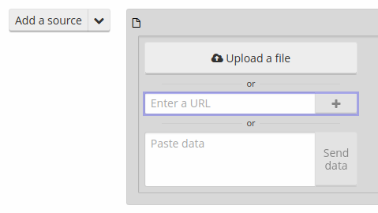
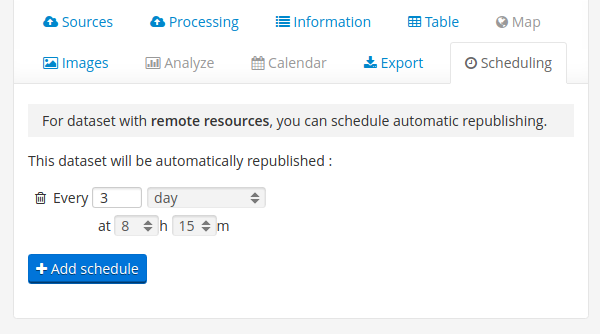
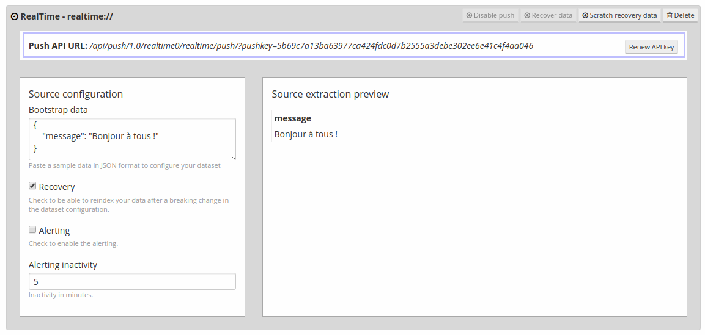
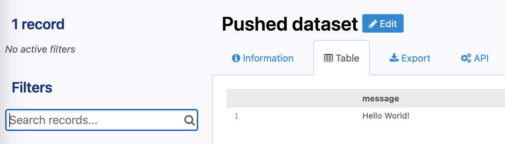
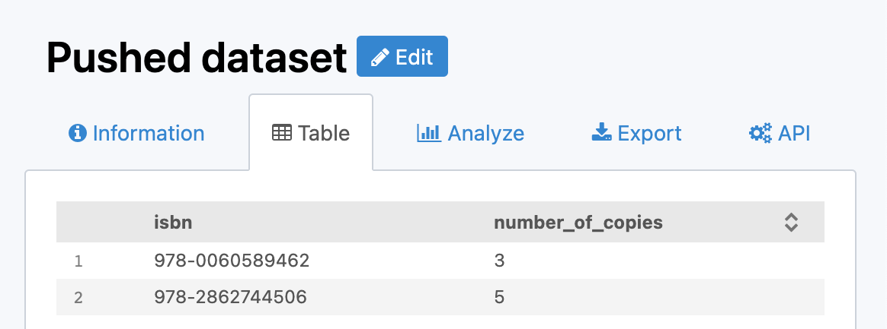
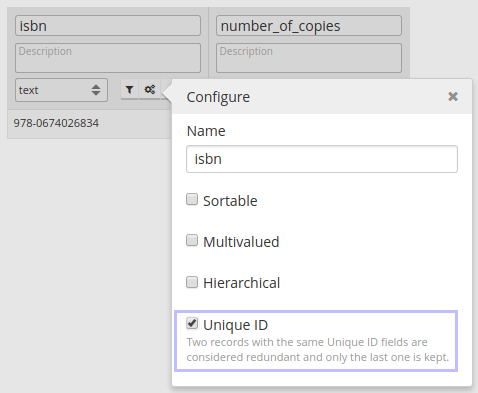
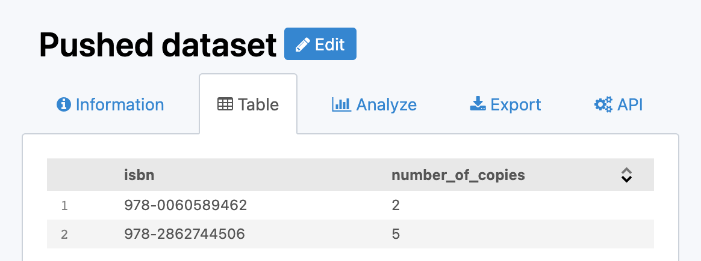
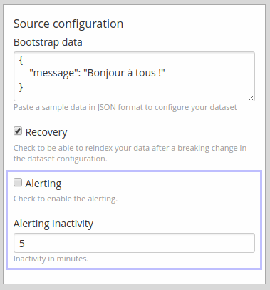

Keeping data up to date
=======================

The OpenDataSoft platform makes it possible, in the very same data catalog, to handle completely static datasets (which need to be published only once) and live datasets (which need to be regularly updated). Two different mechanisms are made available to handle datasets refresh.

The first one is called **scheduling** and consists in having a dataset being automatically republished at fixed intervals. This mode is most useful for datasets with a remote resource which is regularly updated.

The second one consists in pushing data on the OpenDataSoft platform using a dedicated API end point. This mode is most useful when the data can be sent directly by the system that produces the data points, such as a computer program sending event metrics or a set of sensors sending their readings.

Using scheduling to keep a dataset up to date
---------------------------------------------

This solution is the easiest to implement, it does not require any development, only a remote source and some settings in the dataset configuration.

Specifying a resource
~~~~~~~~~~~~~~~~~~~~~

To be able to schedule a dataset, its underlying resource must be a remote one, specified as a URL (http or ftp work well) and not an uploaded file. To add such a resource, simply paste a URL in the URL input.

Specifying scheduling interval
~~~~~~~~~~~~~~~~~~~~~~~~~~~~~~

Once a dataset is saved with a remote resource, the scheduling tab is activated. The minimum interval is the minute, but it is not activated by default. Please contact OpenDataSoft's support if you need minute level scheduling on your domain. You can add as many schedule as you want. For instance, if it fits your needs, you could decide to schedule a dataset to be reprocessed every Monday morning and every Wednesday afternoon.

Pushing real time data
----------------------

For some types of data, it can be useful to push data instead of the more traditional model of having the data being pulled from a resource by the platform. To address this need, the OpenDataSoft platform offers a realtime push API. It is not to be confused with the ability to schedule a dataset processing. When scheduling, the dataset will periodically pull the resource and process the data that is inside of it, whereas with the push API, the dataset is fed by an application through a push API and records are processed one by one as soon as they are received.

.. admonition:: Note
   :class: note

   As this feature is still in beta, it is not activated by default. Please contact OpenDataSoft's support to try it out.

Configuring the dataset schema
~~~~~~~~~~~~~~~~~~~~~~~~~~~~~~

.. image:: images/realtime__dropdown--en.png
    :alt: source dropdown

To create a realtime dataset, start by navigating to the dataset creation interface. Here, select "add a realtime source".

.. image:: images/realtime__resource--en.png
    :alt: realtime resource pane

You will be prompted to enter some bootstrap data and to optionnally fill in additional options. The bootstrap data should have all the fields that will be sent through the API. Please note that the bootstrap data is not used in the dataset: its sole purpose is to allow setting up the dataset.

Using the push url
~~~~~~~~~~~~~~~~~~

Once your dataset is saved with the correct realtime resource settings, a URL path containing a push api key will appear. This path, appended to your domain base URL is where the platform will expect data to be sent after publication. As is the case with the bootstrap data, the data is expected to be sent in the JSON format, either as a single JSON object for a single record, or an array of JSON objects to push multiple records at once.

A mimimal example of the api usage for a dataset with a single field named "message", using curl, would be

.. code-block:: bash

    curl -XPOST <DOMAIN_URL>/api/push/1.0/<DATASET_ID>/<RESSOURCE_ID>/push/?pushkey=<PUSH_API_KEY> -d'{"message":"Hello World!"}'

A minimal example with the same dataset, using the array form to send multiple records at once would be

.. code-block:: bash

    curl -XPOST <DOMAIN_URL>/api/push/1.0/<DATASET_ID>/<RESSOURCE_ID>/push/?pushkey=<PUSH_API_KEY> -d'[{"message":"¡Hola Mundo!"},{"message":"Hallo Welt!"}]'

If the records have been received correctly, the server will respond the following message.

.. code-block:: json

    {
        "status": "OK"
    }

If an error happened while trying to push a record, the response will specify the error.

Pushing a field of type file
~~~~~~~~~~~~~~~~~~~~~~~~~~~~

In order to push a field of type image, a json object containing the base64-encoded content and the mimetype of the file needs to be sent, as such.

.. code-block:: json

    {
        "image_field": {
            "content": "BASE64 data",
            "content-type": "image/jpg"
        }
    }

Update data by defining a unique key
~~~~~~~~~~~~~~~~~~~~~~~~~~~~~~~~~~~~

Sometimes it is useful to update the existing records instead of just pushing new ones. An example for this would be a dataset that tracks the number of copies available for each books in a public library. Suppose that we have such a dataset with two fields: ``isbn``, representing the `ISBN <https://en.wikipedia.org/wiki/International_Standard_Book_Number>`_ number of the book, and ``number_of_copies`` tracking the current number of copies available in the library. It would not make a lot of sense to add one record for each new value of ``number_of_copies``, instead, it would be better to set the new ``number_of_copies`` value to the record corresponding to the book ``isbn``.

In order to set up such a system with the OpenDataSoft platform, the fields that will be used as a unique key must be marked as so. In our example, the unique key would be isbn, because the rest of the data is linked to individual books, and these books are identified by the ISBN. This can be done in the processing view, in the menu that pops when the configuration button is pressed. It is possible to set multiple fields as unique keys. Then, after saving and publishing, if a new record whose key value is equal to an existing record is pushed, the new record will overwrite the old record. In our library case, if your dataset has ``isbn`` as the unique key, and contains these two records.

.. code-block:: json

    [
        {
            "isbn": "978-0060589462",
            "number_of_copies": 3
        }, {
            "isbn": "978-2862744506",
            "number_of_copies": 5
        }
    ]

If somebody borrows a copy of Zen and the Art of Motorcycle Maintenance, and you push the following record, you will still have two records, the first one being updated with the new value.

.. code-block:: json

    {
        "isbn": "978-0060589462",
        "number_of_copies": 2
    }

Delete data
~~~~~~~~~~~

There are two entrypoints that allow for deleting a pushed records. One that uses the records values and one that uses the record ID.

Using the record values
^^^^^^^^^^^^^^^^^^^^^^^

To delete a record knowing the record fields values, POST the record as if you were adding it for the first time, but replace ``/push/`` with ``/delete/`` in the push URL. If your push URL path is ``/api/push/1.0/<DATASET_ID>/<RESSOURCE_ID>/push/?pushkey=<PUSH_API_KEY>``, then use instead ``/api/push/1.0/<DATASET_ID>/<RESSOURCE_ID>/delete/?pushkey=<PUSH_API_KEY>``. A minimal example to delete the record we pushed earlier follows.

.. code-block:: bash

    curl -XPOST <DOMAIN_URL>/api/push/1.0/<DATASET_ID>/<RESSOURCE_ID>/delete/?pushkey=<PUSH_API_KEY> -d'{"message":"Hello World!"}'

Using the record ID
^^^^^^^^^^^^^^^^^^^

If you know the record ID of the record you want to delete, simply make a GET request to the URL you get by replacing ``/push/`` with ``/<RECORD_ID>/delete/`` in the push URL. A minimal example of this follows.

.. code-block:: bash

    curl -XGET <DOMAIN_URL>/api/push/1.0/<DATASET_ID>/<RESSOURCE_ID>/<RECORD_ID>/delete/?pushkey=<PUSH_API_KEY>

Get notified in case of inactivity
~~~~~~~~~~~~~~~~~~~~~~~~~~~~~~~~~~

If you expect a system to push data to the platform often, you may want to be notified if no record has been received by the platform in a while. In order to get notified, you can enable the "Alerting" option in the source configuration, and setup a time threshold in minutes. If a time span greater than the threshold has occured during which no record has been received, you will receive an email.

Unpublishing and disabling the api
~~~~~~~~~~~~~~~~~~~~~~~~~~~~~~~~~~

.. image:: images/realtime__disable--en.png
    :alt: "disable push" button in RT resource view

Beware of unpublishing your dataset, as this will not keep existing records for the next time the dataset is published. If you desire to avoid getting new data, you should instead click the "disable push" button in the resource setting. This will prevent the usage of the push API but will have no effect on existing data. If data is pushed while push is disabled on the resource, no data will be added and an error will be sent.

Recovery
~~~~~~~~

.. image:: images/realtime__recovery_option--en.png
    :alt: recovery option in realtime resource view

In the event of data loss, for instance when the dataset has been unpublished or when a processor has been misconfigured, there is a possibility of recovering the lost records. To do so, the recovery option must have been activated prior to the records being pushed to the platform.

.. image:: images/realtime__recovery_button--en.png
    :alt: recover data button in realtime resource view

When the recovery is activated every subsequent record received will be backed up, and will be elligible for recovery. In order to recover eligible records, the "recover data" button on the source configuration page can be used.
