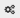
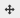
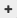

Defining a dataset schema
=========================

Each dataset follows a schema. Fully defining and configuring a dataset schema means:

* :ref:`Changing a dataset field label<changinglabel>` (1)
* :ref:`Adding a description<addingdescription>` to a dataset field (2)
* :ref:`Choosing a type<choosingtype>` for each field (3)
* :ref:`Setting up relevant fields as facets<settingfacets>` to define filters for the dataset (4)
* :ref:`Configuring options<configuringoptions>` for each field, depending on their type and whether they are set up as facets or not (5)
* :ref:`Ordering the fields<orderingfields>` in the dataset (6)
* :ref:`Discarding fields<discardingfields>` from the dataset (7)

.. localizedimage:: images/processing_preview.png
    :alt: Processing tab when publishing a new dataset

.. _changinglabel:

Changing a label
~~~~~~~~~~~~~~~~

The OpenDataSoft platform retrieves the default field labels found in the source dataset. It is however possible to change each dataset field label.

.. admonition:: Note
   :class: note

   We highly recommend to choose well-written, explicit labels. Also keep in mind that since these labels will be displayed in the front office for all portal users, it might be preferable to choose simple labels instead of business-specific terms, to make sure that the data can be understood by a wider audience.

To change a label:

1. In the preview area of the Processing tab, select the current label of the field of your choice.
2. Type a new label. It can contain special characters.
3. Click outside the label area or press Enter for the changes to be taken into account.

.. admonition:: Caution
   :class: caution

   Changing the label of a field does not modify in any way the technical identifier of that field, which can be found in the Configuration menu of the dataset.

.. _addingdescription:

Adding a description to a field
~~~~~~~~~~~~~~~~~~~~~~~~~~~~~~~

Descriptions can be added to dataset fields for more context or precision.

To add a description to a field:

1. In the preview area of the Processing tab, click in the Description text box of the field of your choice.
2. Type the related description.
3. Click outside the Description text box for the description to be taken into account.

Field descriptions will then be displayed in the front office:

* in the Data schema section of the Information tab of the dataset
* in the tooltip of their related fields, in the Table tab

.. _choosingtype:

Choosing a field type
~~~~~~~~~~~~~~~~~~~~~

Fields are characterized by types. Depending on the chosen field type, the platform will process and display records in a specific way.

To choose a type for a field:

1. In the preview area of the Processing tab, click on the field type list box of the field of your choice.
2. Choose the right type for this field.

There are 8 different types: date, datetime, decimal, integer, geopoint, geoshape, text and file.

.. list-table::
   :header-rows: 1

   * * Type
     * Description
   * * Date
     * Field values are dates.
       The ideal format is the ISO 8601 format, which is ``YYYY-mm-dd``. Other formats are also understood by the platform, such as: ``YYYY/mm/dd`` or ``dd/mm/YYYY``.

       .. admonition:: Note
          :class: note

          The platform will try to guess as accurately as possible the input date format. However, in case of bad detection or ambiguity, use the :doc:`Normalize Date processor<processors/normalize_date>` to define the parsing format of the date field.

   * * DateTime
     * Field values are a combination of a date and a time.
       The ideal format is the ISO 8601 format, which is ``YYYY-mm-ddTHH:MM:ss+00:00``, ``YYYY-mm-ddTHH:MM:ssZ`` or ``YYYYmmddTHHMMssZ``. Other formats are also understood by the platform, such as: ``YYYY-mm-dd-HH:MM:ss`` or or ``YYYY-mm-dd HH:MM:ss``.

       .. admonition:: Note
          :class: note

          The platform will try to guess as accurately as possible the input datetime format. However, in case of bad detection or ambiguity, use the :doc:`Normalize Date processor<processors/normalize_date>` to define the parsing format of the datetime field.

       .. admonition:: Note
          :class: note

          By default, time records are in UTC timezone. To change the timezone, use the :doc:`Set Timezone processor<processors/set_timezone>`.

   * * Decimal
     * Field values are decimal numbers.
       Valid separators for the decimal part are ``.`` or ``,``.

   * * Geo point
     * Field values are a single geographical location expressed in the format ``<LAT>,<LON>``, for instance
       ``45.8,2.5``.

       .. admonition:: Note
          :class: note

          If your dataset contains two fields, latitude and longitude, use the :doc:`Create GeoPoint processor<processors/create_geopoint>` to create a valid geo point field.

   * * Geo shape
     * Field values are geographical shapes expressed in `GeoJSON <http://geojson.org/geojson-spec.html>`_. For example :

       .. code-block:: json

          {"type": "LineString",
           "coordinates": [ [100.0, 0.0], [101.0, 1.0] ]}

       .. admonition:: Note
          :class: note

          Feature collections are not supported.

   * * Integer
     * Field values are integer numbers.
       If a floating point value is found, it is automatically cast to its integer part.

   * * Text
     * Field values are textual data.

   * * File
     * Field values are files sourced with one of the available methods to :doc:`create a dataset with images<../01_creating_a_dataset/creating_dataset_with_images>` (with the File processor, through an archive file or with a specific extractor), creating a field which default type is file. This field type is only available in that case.

.. _settingfacets:

Setting up fields as facets
~~~~~~~~~~~~~~~~~~~~~~~~~~~

Facets define the filters of a dataset, which are displayed on the left of the dataset's visualization, in the front office. These filters have several purposes: they allow the users to find specific, precise records into a dataset, but they also allow the creation of charts afterward (if a field's records are other than numbers, they will be usable in the Chart Builder and in the Analyze view only if they are set up as facets).

.. admonition:: Note
   :class: note

   Fields which type is either geo shape or geo point cannot be set up as facets.

To set up a field as a facet:

1. In the preview area of the Processing tab, choose the field you want to set up as a facet. Choose a field relevant enough to become a filter.
2. Click the |icon-facet| button.

.. _configuringoptions:

Configuring field options
~~~~~~~~~~~~~~~~~~~~~~~~~

1. In the preview area of the Processing tab, click the |icon-configuration| button of the field of your choice.
2. Configuration options change depending on the type of the field and on whether the field is set up as a facet or not. Follow the right instructions depending on the chosen configuration option.

Configuration options available for every field
^^^^^^^^^^^^^^^^^^^^^^^^^^^^^^^^^^^^^^^^^^^^^^^

.. list-table::
   :header-rows: 1

   * * Configuration option
     * Description
   * * Name
     * Technical identifier of the field. In contrary to the label, the technical identifier does not have aesthetic purposes and thus cannot contain special characters, including spaces. Technical identifiers can be used for instance when creating a custom tooltip with HTML.

       .. admonition:: Warning
          :class: danger

          Changing the technical identifier of a field could break reuses of the related dataset (custom tooltip, custom tab or pages). It could also be a problem if the source of the dataset is (regularly) updated: when replacing a source with a newer one, the platform checks the technical identifier of the fields of both sources in order to find a match between the two -then replacing the old data with the new ones. If technical identifiers are not the same anymore, the dataset cannot be updated.

       To change the technical identifier of a field:

       1. Select the current technical identifier of the field, written in the text box under "Name".
       2. Type a new technical identifier. It musn't contain special characters.
       3. Click outside the text box or press Enter for the change to be taken into account.

   * * Unique ID
     * Each record is uniquely identified by its identifier, which is by default computed as the fingerprint of all the record fields values. If the Unique ID option is activated for a field, records with the same identifier (or value) are deleted for only the last/oldest one to stay in the dataset. It is most useful for real-time datasets, to make sure that instead of adding new records every time the dataset is updated, new values replace the old ones.

       To activate the Unique ID option of a field:
       Tick the Unique ID box.

Configuration options for date & datetime fields
^^^^^^^^^^^^^^^^^^^^^^^^^^^^^^^^^^^^^^^^^^^^^^^^

.. list-table::
   :header-rows: 1

   * * Configuration option
     * Description
   * * Precision
     * Degree of precision of the date or datetime field.

       To define a degree of precision:

       1. Click on the Precision list box of the field of your choice.
       2. Choose a degree of precision:

       For date fields:

       * year: only the year of the date is displayed in the dataset
       * month: only the month and year of the date are displayed in the dataset
       * day: the full date (day, month and year) is displayed in the dataset

       For datetime fields:

       * hour
       * minute

       As for the datetime precisions, the full datetime (hour and minutes) is displayed in the dataset. The difference is in the Analyze view and in the Chart Builder where the degree of precision is available to configure the chart.

Configuration options for decimals & integer fields
^^^^^^^^^^^^^^^^^^^^^^^^^^^^^^^^^^^^^^^^^^^^^^^^^^^

.. list-table::
   :header-rows: 1

   * * Configuration option
     * Description
   * * Unit
     * Unit of the field, to display along with the decimal or integer value.

       To define a unit for a field:

       1. Click on the Unit list box of the field of your choice.
       2. Choose the right unit among the list.

   * * Enforce the number of decimals to display
     * Chosen number of decimals for all values of the field.

       To define a number of decimals for a field:

       1. Tick the "Enforce the number of decimals to display" box.
       2. In the text area below, type the number of decimals of your choice, or use the arrows to do so.

Configuration options for text fields
^^^^^^^^^^^^^^^^^^^^^^^^^^^^^^^^^^^^^

.. list-table::
   :header-rows: 1

   * * Configuration option
     * Description
   * * Sortable
     * By default, only numerical fields (decimals and integers) are sortable. This option activates sorting on textual fields. It is then possible, when in the Table view of the dataset in the front office, to sort text fields in an alphabetical order.

       To make a field sortable:
       Tick the "Sortable" box.

   * * Multivalued
     * This option is for multi-valued records separated by one same separator. Example: *France,UK,USA* When set up as a facet, each of the field's records values appears as a separate entry in the filters section. When clicking on one of the entry, all the other entries which are not related (meaning the entries which never appear in the same record as part of a multi-values combination) automatically disappear -only the related entries remain as available filter entries.

       To activate the multivalued option:

       1. Tick the "Multivalued" box.
       2. In the text box below, type the separator between the values of the records.
       3. Click outside the text box or press Enter for the change to be taken into account.

   * * Hierarchical
     * This option is for multi-valued records, separated by one same separator and which have a hierarchical relation. Example: *France/Ile-de-France/Paris* When set up as a facet, each first value of each record's multi-values combination appears as a separate entry in the filters section. When clicking on one entry, all second-level values related to that entry appear, and so on. Example: After clicking on the filter entry *France*, the related second-level entry *Ile-de-France* appears. After clicking on *Ile-de-France*, the related third-level entry *Paris* appears.

       To activate the hierachical option:

       1. Tick the "Hierarchical" box.
       2. In the text box below, type the separator between the values of the records.
       3. Click outside the text box or press Enter for the change to be taken into account.

Configuration options for facets
^^^^^^^^^^^^^^^^^^^^^^^^^^^^^^^^

.. list-table::
   :header-rows: 1

   * * Configuration option
     * Description
   * * Sort facet by
     * Chosen sorting of the field's entries in the filters section of the front office.

       To chose a sorting order for a facetted field:

       1. Click on the "Sort facet by" list box of the field of your choice.
       2. Choose a sorting order:

       - Item counting (descending): entries are ordered from the one with the less records to the one with the most
       - Item counting (ascending): entries are ordered from the one with the most records to the one with the less
       - Name (descending): entries are ordered in an alphabetical order
       - Name (ascending): entries are ordered in a reverse alphabetical order

   * * Allow multiple selection in filters
     * By default, after clicking on a filter entry, the others disappear. With the multiple selection option, it is possible to select several filter entries.

       To allow multiple selection in filters: Tick the "Allow multiple selection in filters" box.

.. _orderingfields:

Ordering fields in datasets
~~~~~~~~~~~~~~~~~~~~~~~~~~~

Dataset fields can be reordered in their dataset. It can have 2 kinds of impact:

- In the filters section of the dataset, in the front office. Changing the order of the fields in the dataset also changes the order of the filters. The first facetted field of the dataset becomes the first displayed filter, and so on.
- In case the dataset contains geo shape fields. The Map view cannot display more than one layer of geo shapes, the geo shapes layer displayed by default must thus be defined. To do so, the field containing the geo shapes to be displayed by default on the map must the ordered before all other geo shapes fields.

To reorder a field in a dataset:

1. In the preview area of the Processing tab, click on the |icon-order| button of the field you want to reorder in the dataset.
2. While maintaining the click on the Reorder button, drag the field to its new position in the dataset.
3. Once the field in its new position in the dataset, stop maintaining the click.

.. _discardingfields:

Discarding fields from datasets
~~~~~~~~~~~~~~~~~~~~~~~~~~~~~~~

Dataset fields can be discarded from the dataset. It does not mean that the field is completely removed from the dataset but only deleted from the output. This is why, once the dataset is published, the discarded field will not be displayed in any visualization and if the dataset is exported, the discarded field will not be in the export.

To discard a field from a dataset:
Click on the |icon-delete| button of the field you want to discard from the dataset.

Since discarded fields are not completely removed from the dataset, they can be restored at any time.

To restore a discarded field from a dataset:

1. In the preview area of the Processing tab, swipe to the right to go to the last fields of the datasets.
2. The discarded fields of the dataset appear at the very end of the dataset, they look like blank, grey columns named by their technical identifiers. Find those you want to restore.
3. Click on the |icon-retrieve_discarded| button.

.. |icon-facet| image:: icons/facet.png
    :width: 18px
    :height: 18px

.. |icon-delete| image:: icons/delete.png
    :width: 20px
    :height: 18px

