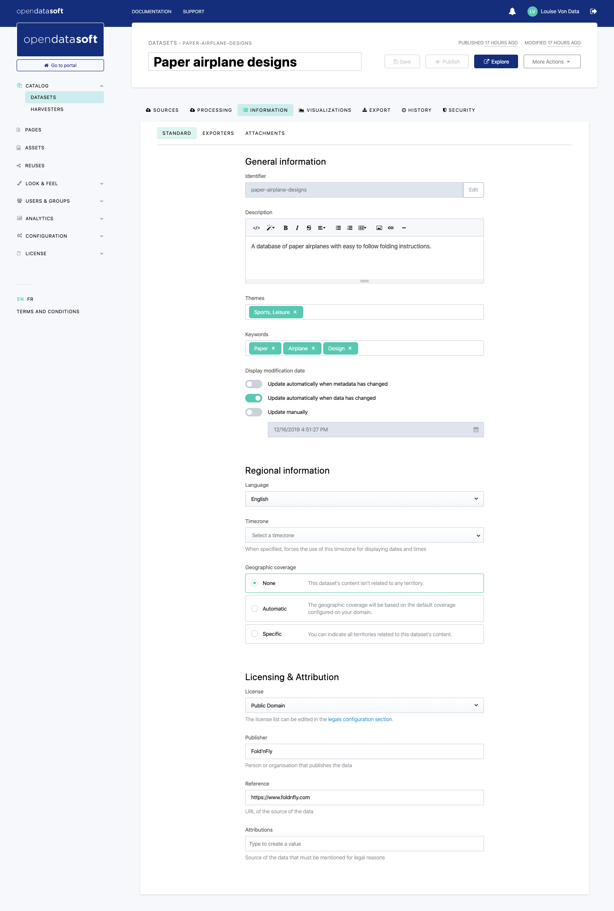

Configuring metadata
====================

Metadata can be seen as the data describing the dataset itself. They are indeed a set of fields that, once filled up, describe the dataset and the data it contains. Filling up the metadata of a dataset is really important: it helps make sure that the dataset can be found, understood, and reused by users. When activated, interoperability metadata are just as important: they help make sure that other systems can understand the content of the dataset.

In the Opendatasoft platform, all metadata configurations are done in the Information tab.

.. admonition:: Note
   :class: note

   The Information tab also contains an Attachments tab that allows the upload of files related to the dataset (for example, information documents to explain in details the fields and data, methodology documents on how the data was collected, etc.).

   Metadata is not stripped from uploaded files. The tags may expose sensitive information, such as geolocation data or device information.
   
   Before uploading files, make sure you strip metadata you want to keep private.

There are 4 kinds of metadata in the Opendatasoft platform:

- **Standard metadata** *(default)*: basic metadata displayed in the front office for the users.
- **Interoperability metadata** *(on demand)*: intended for automatic usage by other systems for interoperability purposes or regulatory compliance.
- **Admin metadata** *(on demand)*: intended for administrators usage only, therefore never displayed anywhere in the front office.
- **Applicative metadata** *(on demand)*: intended for specific applications and not expected to be used by users directly. In most cases, the users will never have to access or edit them by themselves. They can be visible from the front office but also through the Opendatasoft Search API. The extra metadata will not be included in this documentation. Please contact Opendatasoft for more information about these metadata.

.. toctree::
   :maxdepth: 2

   standard_metadata
   interoperability_metadata
   admin_metadata
