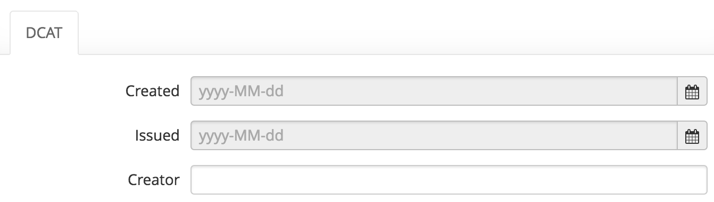

Configuring metadata
====================

What is metadata?
~~~~~~~~~~~~~~~~~

Metadata is data describing the dataset itself. This is a set of fields describing
the data, such as a title, a description, a list of keywords, a modification date, or whether
the dataset is compliant to a specific geospatial norm. Adding metadata on a dataset
is important to make sure it can be found, understood, and reused by users. In some cases,
it can also be important for interoperability, to make sure other systems can
understand the content of the dataset.

Different kinds of metadata
~~~~~~~~~~~~~~~~~~~~~~~~~~~

The OpenDataSoft platform considers three kinds of metadata:

- basic: this is the information users can see in the "Informations" tab of your
  dataset, and is generally intended to be readable by humans. This includes the title,
  the license attached to the data... If you want an information to be seen by
  users on the portal, it should probably be a basic metadata.

- interoperability: metadata usually described in specific standards (such as DCAT
  or INSPIRE), intended for automatic usage by other systems for interoperability
  purposes, or for regulatory compliance.

- extra: metadata intended for specific applications, and not expected to be used
  by users directly. For example, if you configure your default visualizations on
  the OpenDataSoft portal, this information is stored as an extra metadata.
  In most cases, you will never have to access or edit them by yourself.

Filling metadata
~~~~~~~~~~~~~~~~

When creating or editing a dataset from the back-office, you can fill the metadata
from the "Information" tab.

.. image:: images/metadata__form--en.png

You are presented with a form representing all the available metadata to fill
for the dataset. The first part of the form represents all the basic metadata.
The second part of the form represent the groups of interoperability metadata
available on the portal.

Standard metadata
~~~~~~~~~~~~~~~~~

The following metadata fields are available by default:

- **Title**: the title of the dataset

- **Description**: the full description of the dataset (HTML is accepted)

- **Geographic area**: the geographical coverage of the data

- **Last modification**: the last modification date of the dataset (manually set)

- **Language**: the language (as a two-letter language code) of the dataset's
  data and metadata

- **License**: the license attached to the dataset; should always be filled for any
  public dataset

- **Theme**: one or more themes associated to the dataset (Environment...)

- **Keywords**: one or more keywords for the dataset, mostly used to make it
  easier to find in the catalog

- **Publisher**: the publisher of the dataset (the name of a person or of an
  organization)

- **References**: one or more links to indicate the references or sources of
  the dataset

Customizing available metadata
~~~~~~~~~~~~~~~~~~~~~~~~~~~~~~
It is possible to add custom metadata, or groups of metadata on an OpenDataSoft
portal. If you need additional metadata, please contact us for more information.
