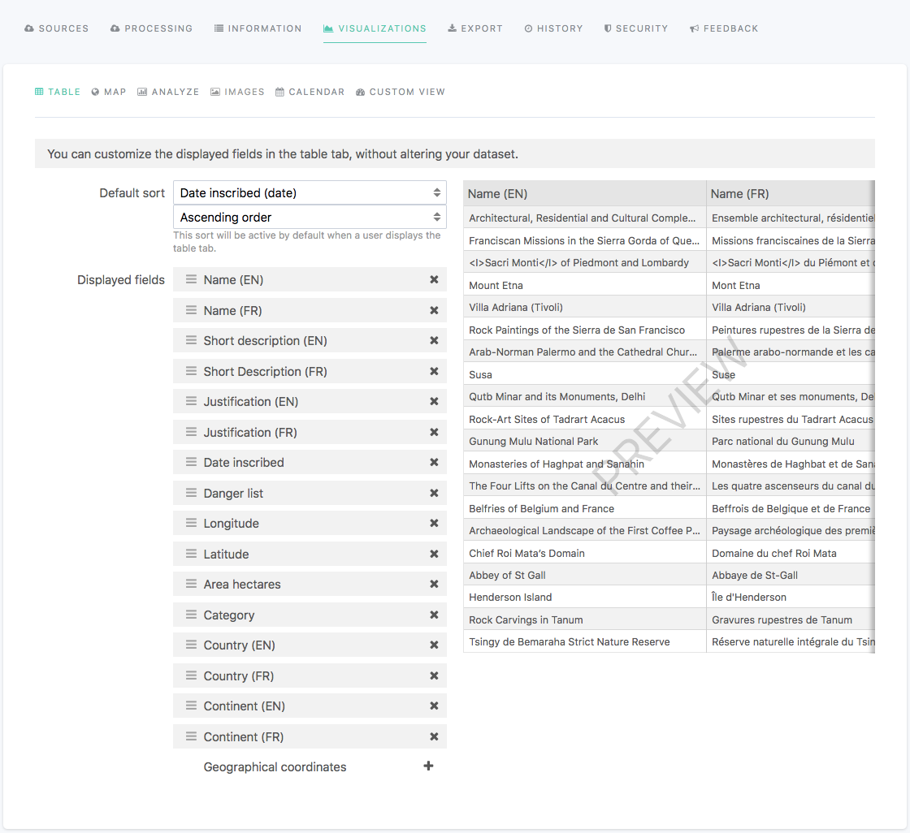

Configuring the Table visualization
===================================

.. admonition:: Prerequisite
   :class: important

   For the Table visualization to be available, the dataset must contain at least one source.

In the edition interface of a dataset, the Visualizations > Table tab allows to configure the Table visualization displayed in the front office once the dataset is published on the portal.

The Table visualization cannot be disabled.

To configure the Table visualization, follow the indications from the table below.

.. list-table::
  :header-rows: 1

  * * Option name
    * Description
    * Usage
  * * Default sort
    * By default, the Table visualization keeps the order of the records as it is after they have been processed. It is possible to define another default sort by choosing a field and a sort type.
    * 1. Click on the "Default sort" list box.
      2. Choose a field from the dataset on which the sorting will be based.
      3. Click on the second list box displayed below the first one.
      4. Choose a sort type.
  * * Displayed fields
    * By default, the Table visualization keeps the order of the fields as it is after they have been processed. It is possible to reorder fields, as well as to hide them.

      .. admonition:: Important
         :class: important

         Reorganizing and hiding fields from the Table visualization configuration tab only changes the Table visualization displayed in the front office. In contrary to when :ref:`using the Processing tab<orderingfields>`, removing a field from the Table visualization will not remove it from the dataset itself, and it will still be available in other visualizations, as well as if the dataset is exported.

    * To reorder fields:

      1. Click on a field among the list.
      2. Drag and drop the field above or below another one.

      To hide a field from the Table visualization:

      1. Find the field among the list.
      2. Click on the X icon at the right of the field.
