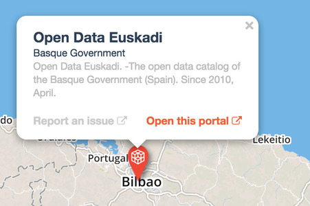

Configuring the map view
========================

.. admonition:: Note
   :class: note

   The map view is only available to datasets containing at least one geo field (geo point or geo shape).

You can configure the appearance of the map itself:

- If a tooltip displays more than one item (when multiple records have the same location for example), you can set
  their relative order
- If you have more than one basemap on your domain, you can set which one is
  selected by default for this dataset (otherwise it is the first one in the list)
- The color of the shapes and points displayed on the map
- If the data is represented as points, you can configure how it is displayed:
  a simple icon, little dots, or a familiar marker

.. ifconfig:: language == 'en'

   .. figure:: images/map__options--en.jpg

      The map view options

.. ifconfig:: language == 'fr'

   .. figure:: images/map__options--fr.jpg

      The map view options

Setting up the tooltip
----------------------

On a map, a click on a point will bring forward a tooltip containing more information

You can :doc:`configure the tooltip</publishing_data/07_configuring_visualizations/02_configuring_map_view/tooltip>` in exactly the same way than for the image gallery or the calendar.
