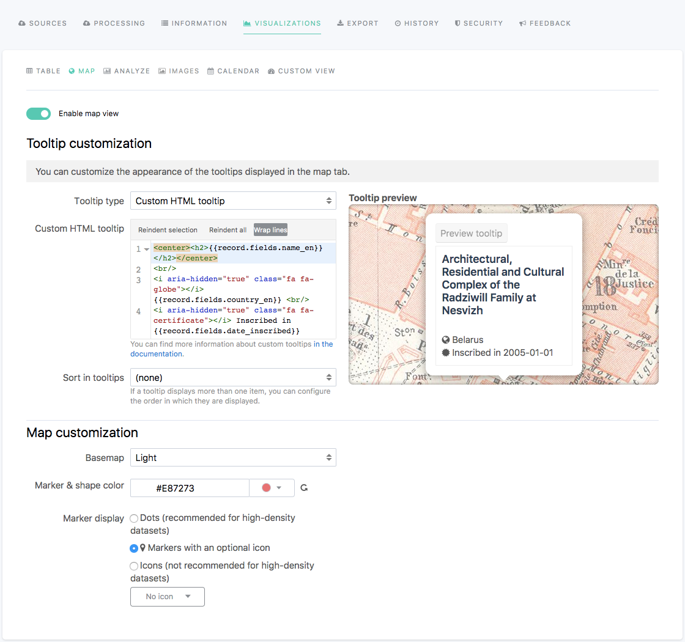

Configuring the Map visualization
=================================

.. admonition:: Prerequisite
   :class: important

   For the Map visualization to be available, the dataset must contain at least one geographical field (:ref:`Geo point or Geo shape<choosingtype>`).

In the edition interface of a dataset, the Visualizations > Map tab allows to configure the Map visualization displayed in the front office, once the dataset is published on the portal.

The Map visualization, when available, is optional. It can be enabled or disabled using the tick box displayed right under the visualizations tabs.

Customizing the tooltip
-----------------------

The "Tooltip customization" section contains a variety of options to customize the tooltips that can be displayed on the Map visualization of a dataset. A tooltip is a box that appears when clicking on an element of the map that represents data (e.g. a map marker, a geographical shape). The tooltip displays information about its related data.

.. admonition:: Important
   :class: important

   For more information about tooltips and how to configure both Standard and Custom HTML tooltips, see :doc:`Configure the tooltip</publishing_data/07_configuring_visualizations/02_configuring_map_view/tooltip>` documentation.

To customize the tooltips of the Map visualization, follow the instructions from the tables below.

.. list-table::
  :header-rows: 1

  * * Option name
    * Description
    * Usage
  * * Tooltip type
    * 3 tooltip types:

      - Standard tooltip (default): allows the choice of a title and of the fields displayed in the tooltip.
      - Custom HTML tooltip: allows a further customization of the tooltip, using HTML.
      - No tooltip: disables the tooltips for the Map visualization of the dataset.
    * 1. Click on the "Tooltip type" list box.
      2. Choose a tooltip type.

**Standard tooltip options**

.. list-table::
  :header-rows: 1

  * * Option name
    * Description
    * Usage
  * * Tooltip title
    * Title of the tooltip based on a chosen field from the dataset.
    * 1. Click on the "Tooltip title" list box.
      2. Choose a field from the dataset, on which the title will be based.
  * * Displayed fields
    * Fields from the dataset which values will be displayed in the tooltip. In the list, the fields with a grey background are those that will be displayed in the tooltip, whereas those without a colored background will be hidden from the tooltip.
    * To add a field in the tooltip:

      1. Find the field among the list.
      2. Click on the + icon at the right of the field.

      To hide a field from the tooltip:

      1. Find the field among the list.
      2. Click on the X icon at the right of the field.

      To reorder the fields:

      1. Click on a field among the list.
      2. Drag and drop the field above or below another one.
  * * Sort in tooltips
    * When more than one tooltip is related to one same element on the map, it is possible to define a sort to order these tooltips.
    * 1. Click on the "Sort in tooltips" list box.
      2. Choose a field from the dataset, on which the sorting will be based.
      3. Click on the second list box, displayed below the first one.
      4. Choose a sort type.

**Custom HTML tooltip options**

.. list-table::
  :header-rows: 1

  * * Option name
    * Description
    * Usage
  * * Custom HTML tooltip
    * HTML area to write the content of the tooltip. 3 buttons above the text area allow to reindent a selection, reindent the whole HTML text and/or to wrap the lines.
    * Write the content of the tooltip in HTML.
  * * Sort in tooltips
    * When more than one tooltip is related to one same element on the map, it is possible to define a sort to order these tooltips.
    * 1. Click on the "Sort in tooltips" list box.
      2. Choose a field from the dataset, on which the sorting will be based.
      3. Click on the second list box, displayed below the first one.
      4. Choose a sort type.

Customizing the map
-------------------

The "Map customization" section contains a variety of options to customize both the map itself (the basemap) and the elements that represent the data (map markers, geographical shapes).

To configure the map of the Map visualization, follow the instructions from the table below.

.. list-table::
  :header-rows: 1

  * * Option name
    * Description
    * Usage
  * * Basemap
    * Basemap that will be used by default for the Map visualization. To appear in the list, the basemaps should be configured in the Look & feel > Data visualizations section of the back office (see :doc:`Adding basemaps</customizing_look_and_feel/04_configuring_data_visualizations/basemaps>` documentation).
    * 1. Click on the "Basemap" list box.
      2. Choose a basemap from the list.
  * * Marker & shape color
    * Color of the marker or shape on the Map visualization.
    * 1. Click on the color menu.
      2. Choose a color from the Nice colors or with the Color picker.
      3. Click on the Select color button.
  * * Marker display
    * 3 possible ways to display markers:

      - as Dots,
      - as map Markers (by default, with a simple dot inside, but there can be any icon instead),
      - as an Icon.
    * To choose a marker display, tick the box related to the chosen one.

      To choose an Icon (either for the map Markers or the Icons displays):

      1. Click on the Icon menu.
      2. Choose an icon.
      3. Click on the Select icon button.
