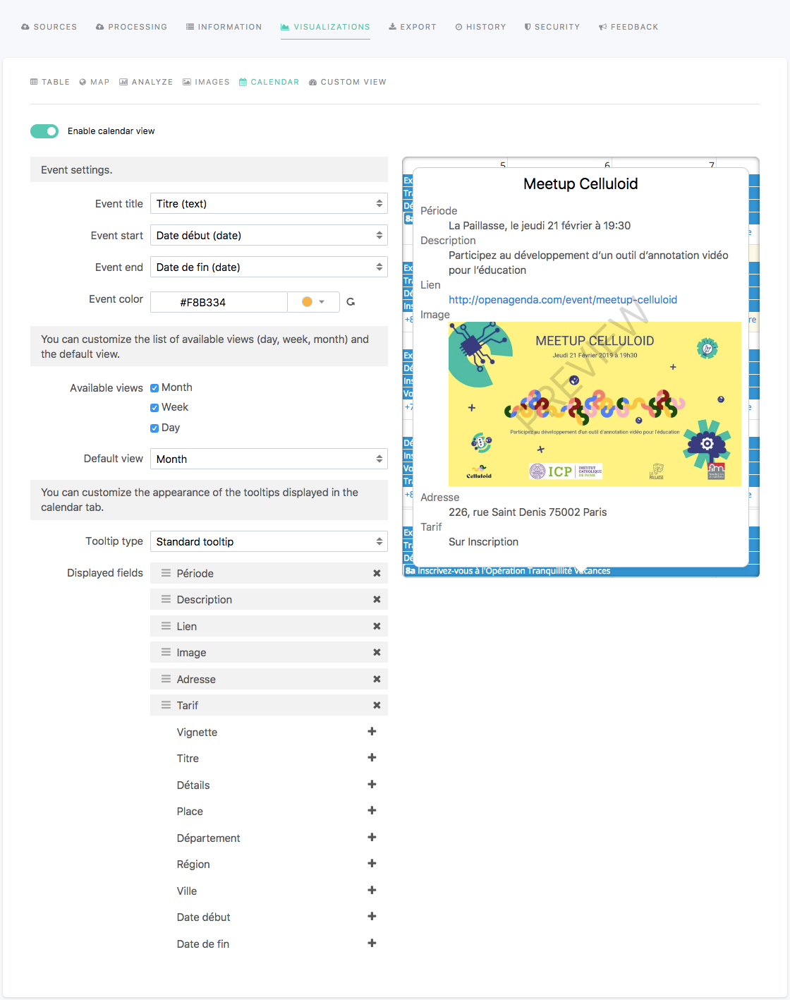

Configuring the Calendar visualization
======================================

.. admonition:: Prerequisite
   :class: important

   For the Calendar visualization to be available, the dataset must contain at least one :ref:`date or datetime field<choosingtype>`, and a text field containing the title of the calendar event.

In the edition interface of a dataset, the Visualizations > Calendar tab allows to configure the Calendar visualization displayed in the front office once the dataset is published on the portal.

The Calendar visualization, when available, is optional. It can be enabled or disabled using the tick box displayed right under the visualizations tabs.

To configure the Calendar visualization, follow the indications from the tables below.

.. list-table::
  :header-rows: 1

  * * Option name
    * Description
    * Usage
  * * Event title
    * Title of the event, used as a tooltip title.
    * 1. Click on the "Event title" list box.
      2. Choose a field from the dataset, which contains the events titles.
  * * Event start
    * Start date of the event.
    * 1. Click on the "Event start" list box.
      2. Choose a field from the dataset, which contains the start dates of the events.
  * * Event end
    * End date of the event.
    * 1. Click on the "Event end" list box.
      2. Choose a field from the dataset, which contains the end dates of the events.
  * * Event color
    * Color of the event on the Calendar visualization.
    * 1. Click on the color menu.
      2. Choose a color from the Nice colors or with the Color picker.
      3. Click on the Select color button.
  * * Available views
    * 3 possible views on which to display events of the Calendar view:

      - Month, to display a monthly calendar
      - Week, to display a weekly calendar
      - Day, to display a daily calendar
    * Tick a box to display a chosen view. Untick a box to hide a chosen view.
  * * Default view
    * Default view when landing on the Calendar visualization tab.
    * 1. Click on the "Default view" list box.
      2. Choose a default view.
  * * Tooltip types
    * 2 tooltip types:

      - Standard tooltip (default): allows the choice of a title and of the fields displayed in the tooltip.
      - Custom HTML tooltip: allows a further customization of the tooltip, using HTML.
    * 1. Click on the "Tooltip types" list box.
      2. Choose a tooltip type.

**Standard tooltip options**

.. list-table::
  :header-rows: 1

  * * Option name
    * Description
    * Usage
  * * Displayed fields
    * Fields from the dataset which values will be displayed in the tooltip. In the list, the fields with a grey background are those that will be displayed in the tooltip, whereas those without a colored background will be hidden from the tooltip.
    * To add a field in the tooltip:

      1. Find the field among the list.
      2. Click on the |icon-plus| icon at the right of the field.

      To hide a field from the tooltip:

      1. Find the field among the list.
      2. Click on the |icon-cross| icon at the right of the field.

      To reorder the fields:

      1. Click on a field among the list.
      2. Drag and drop the field above or below another one.

**Custom HTML tooltip options**

.. list-table::
  :header-rows: 1

  * * Option name
    * Description
    * Usage
  * * Custom HTML tooltip
    * HTML area to write the content of the tooltip. 3 buttons above the text area allow to reindent a selection, reindent the whole HTML text, and/or to wrap the lines.
    * Write the content of the tooltip in HTML.

