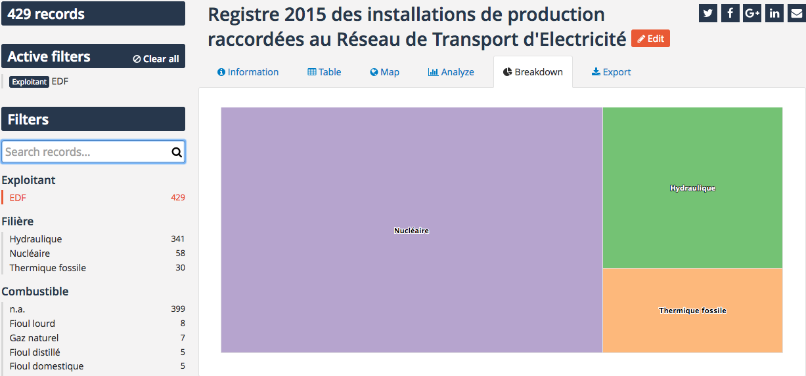

Configuring the custom view
===========================

Standard views allow your users to dive further into your datasets, but they are tools. They do not provide additional
context and do not highlight what you think are the key facts to take away. And while the *description* metadata adds a
bit of context, it is limited to pure text.

The custom view is an additional tab that lives alongside the other tabs on the dataset's page. It is an empty space
that you can use as you wish. An HTML and CSS editor enables you to write a dashboard as simple or as complex as you may
want (for more information about writing beautiful dashboard, see the
:doc:`dedicated documentation </creating_content/index>`) and you can even customize the title and icon of this additional tab.

.. ifconfig:: language == 'en'

   .. figure:: images/custom__view--en.png

      The custom view editor

.. ifconfig:: language == 'fr'

   .. figure:: images/custom__view--fr.png

      The custom view editor

Tab icon and title
------------------

The custom title and icon will show up within your catalog page on the related dataset's card, and you'll be able to
search for datasets having a custom view set up with the *View* filter (select the *Custom view* option).

Icons are taken from the `Font awesome 4.7 icon set <https://fontawesome.com/v4.7.0/icons/>`_ and must be specified through
their name (omitting the ``fa-`` prefix). For example, to use the `bar chart <https://fontawesome.com/v4.7.0/icon/bar-chart>`_
icon, whose name is ``fa-bar-chart``, you should input ``bar-chart`` in the icon field. You can also leave this field
empty, in which case it will default to the `tachometer icon <https://fontawesome.com/v4.7.0/icon/tachometer>`_.

Tab content
-----------

The HTML and CSS code you'll be writing for the tab content isn't isolated from the rest of the page. It is integrated
within an already rich interface and can take advantage of the existing dataset context to interact with the filters.

In order to illustrate the different possibilities, we'll use a dataset listing all `new power plant installations in
2015 in france <https://rte.opendatasoft.com/explore/dataset/registre_parc_prod_rpt/>`_ alongside their respective
power capacity, breaking them down by nature (nuclear, wind, solar...) and region.

To illustrate the relative importance of the various sources of energy within these new installations, we'll build a
treemap with the analyse tab and set this visualization in the custom tab.

.. figure:: images/custom__treemap.png

    The treemap we want to see.

The share panel at the bottom of the analyze tab gives us the following widget code for this treemap.

.. code-block:: html

    <ods-dataset-context context="registreparcprodrpt"
                         registreparcprodrpt-dataset="registre_parc_prod_rpt">
        <ods-chart>
            <ods-chart-query context="registreparcprodrpt" field-x="filiere">
                <ods-chart-serie expression-y="puissance_maximale_mw"
                                 chart-type="treemap"
                                 function-y="SUM"
                                 color="range-Accent"
                                 scientific-display="true">
                </ods-chart-serie>
            </ods-chart-query>
        </ods-chart>
    </ods-dataset-context>

We can of course copy/paste this code into the custom view's HTML code editor and it will give us the requested treemap.
However, since we're creating an independant dataset context (named `registreparcprodrpt` in this case), this treemap
will be independant from the rest of the dataset's page, and especially independant from the active filters.

This means that we can't take advantage of the existing *producer* filter to refine the treemap and see what technology
such and such company is more investing in.

.. figure:: images/custom__static-treemap.png

    The treemap in the custom view is not affected by the active filter

In order to work with the existing dataset context, we just have to plug the ``ods-chart`` widget not on a custom
context defined within the custom view but directly on the global context set for the page, which is named ``ctx``, as
such.

.. code-block:: html

    <ods-chart>
        <ods-chart-query context="ctx" field-x="filiere">
            <ods-chart-serie expression-y="puissance_maximale_mw"
                             chart-type="treemap"
                             function-y="SUM"
                             color="range-Accent"
                             scientific-display="true">
            </ods-chart-serie>
        </ods-chart-query>
    </ods-chart>

This time, the treemap will be actualized depending on the current filters, which allows for more in-depth exploring.

    The treemap in the custom view is now taking into account active filters

Depending on your analysis, you may want to have both static and dynamic visualizations within your custom view, and
nothing prevents you from doing so. You'll just have to plug the dynamic ones onto the ``ctx`` context and define new
``ods-dataset-context`` for static ones.
