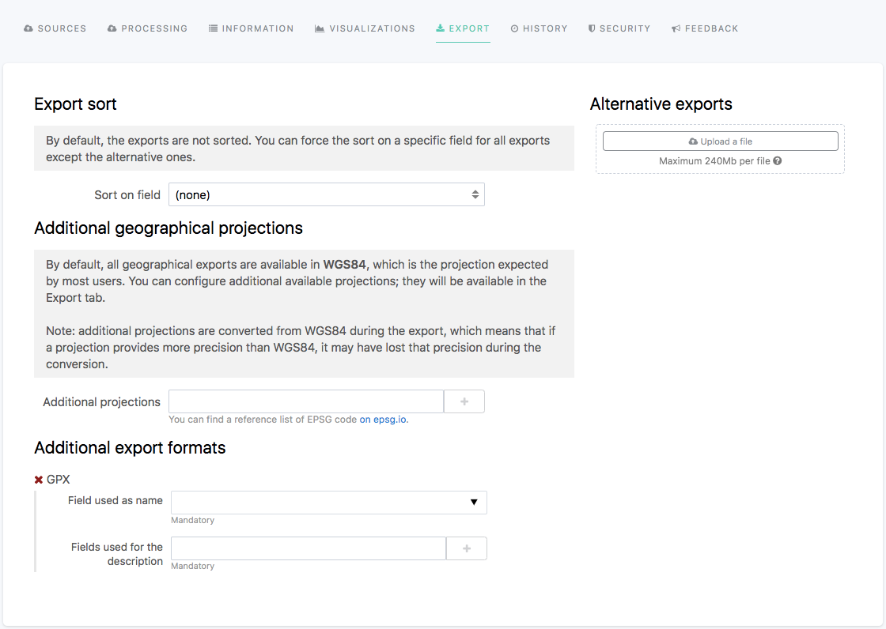

Configuring dataset export
==========================

Users can download any published dataset in a variety of formats from the Export tab of the front office (see :doc:`Exporting data </exploring_catalog_and_datasets/04_getting_involved/exporting_data>`).

In the Opendatasoft platform, the configuration of the available exports is done in the Export tab of the edition interface of each dataset.

Specifying a sort for exports
-----------------------------

By default, the records of a dataset export are not ordered. It is possible to configure the sorting of the records by choosing a sort type for a chosen field.

.. admonition:: Prerequisite
   :class: important

   Only fields that can be sorted by default or fields that have been set as sortable can be selected for this feature.

1. In the Export sort area, click on the "Sort on field" list box.
2. Choose a field from the dataset on which the sorting will be based.
3. Click on the second list box, displayed below the first one.
4. Choose a sort type.

.. admonition:: Important
   :class: important

   The sort does not apply to additional export formats.

Adding other geographical projections
-------------------------------------

The geographical coordinates of a published dataset are by default expressed in WGS84, no matter what was their original projection when creating the dataset. It is possible to configure additional geographical projections to enable users to export the dataset in their preferred geographical projection.

1. In the Additional geographical projections area, click on the Additional projections textbox.
2. Write the EPSG code of the chosen geographical projection. Or, choose one from the suggestions list.

Adding more export formats
--------------------------

More specific formats can be available for export:

- GPX (default): this format can directly be configured from the Export tab to be available as an additional export format. Note that the GPX format requires the dataset to contain geographical coordinates to be available.
- CIFS (on demand): for datasets pushing data to Waze. Once activated on the domain, this format can be configured from the Export tab.
- DCAT-AP for Sweden, Spain, Germany, and Switzerland (on demand): these formats must be configured by Opendatasoft. They are never displayed in the Export tab of the edition interface of the dataset.

.. admonition:: Important
   :class: important

   Please contact Opendatasoft's support team to know more about and/or to ask for the activation of additional export formats.

Uploading alternative exports
-----------------------------

The Alternative exports area of the Export tab allows to upload any file of any format.

To upload an alternative export file, either click the Upload a file button or drag and drop the file in the area.

.. warning::
   Metadata is not stripped from uploaded files. The tags may expose sensitive information, such as geolocation data or device information.
   
   Before uploading files, make sure you strip metadata you want to keep private.
