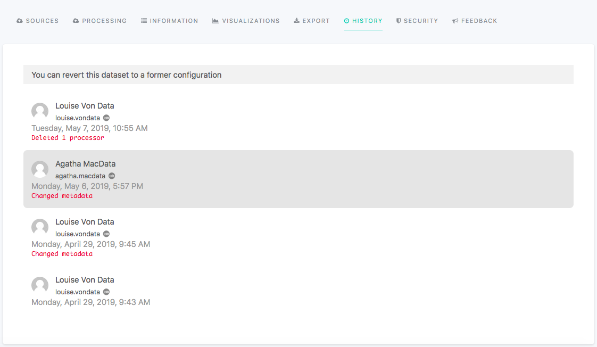

Checking dataset history
========================

The History tab displays the list of items representing all actions operated on the dataset since its creation.

.. admonition:: Important
   :class: important

   The actions operated on the Security tab are never taken into account to update the dataset history, thus never displayed in the History tab.

Each listed item gives the following information:

- name of the user who operated the action(s)
- date when the action(s) was operated
- nature of the action(s)

.. admonition:: Note
   :class: note

   The only item without any action description should be at the bottom of the history: it corresponds to the creation of the dataset.

Reverting to a former configuration
-----------------------------------

It is possible to revert to a former version of the dataset by clicking on an item from the History tab.

Instead of erasing items from the list, it creates a new item indicating which actions were operated to revert to the chosen former configuration.

.. admonition:: Caution
   :class: caution

   Use this feature with caution, as it can be risky for the dataset when it comes to more important configurations. We especially would not advise to go back to a configuration that was operated before a source change.
