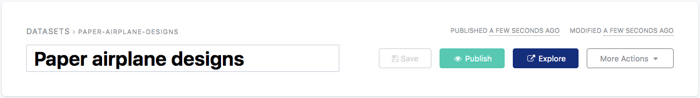

Publishing a dataset
====================

Once the dataset is ready, after it was fully configured, it should be published in order to appear in the front office of the portal, where users can discover the published data.

.. admonition:: Warning
   :class: warning

   Make sure to have properly configured the Security tab beforehand to avoid the dataset to be accessible by everyone if it actually was supposed to be only accessible by specific users.

In case the dataset has already been published at least once but has been modified, it needs to be republished for these modifications to be seen in the front office of the portal.

To (re)publish a dataset:

1. Click on the Save button.
2. Click on the Publish button.
3. (optional) Click on the Explore button to directly access the dataset in the front office, and check the result.

.. admonition:: Note
   :class: note

   To know more about the possible actions to operate on a dataset and the different statuses of the life cycle of a dataset, refer to :doc:`the Dataset actions and statuses documentation<dataset_actions_status>`.

.. toctree::
   :maxdepth: 0
   :hidden:

   dataset_actions_status
