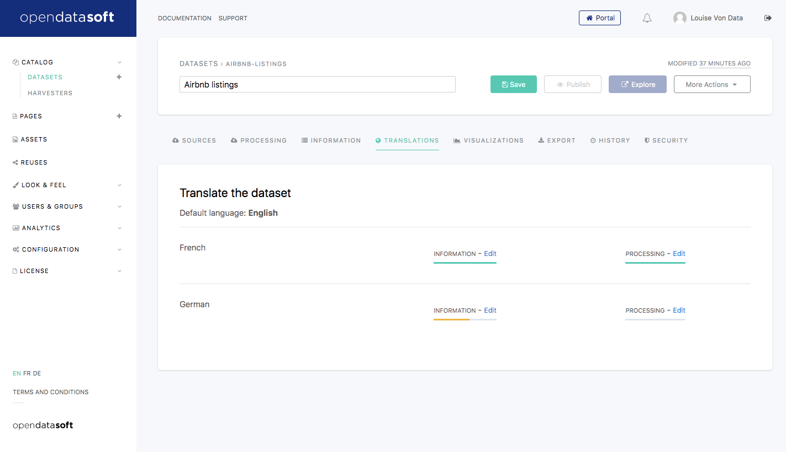
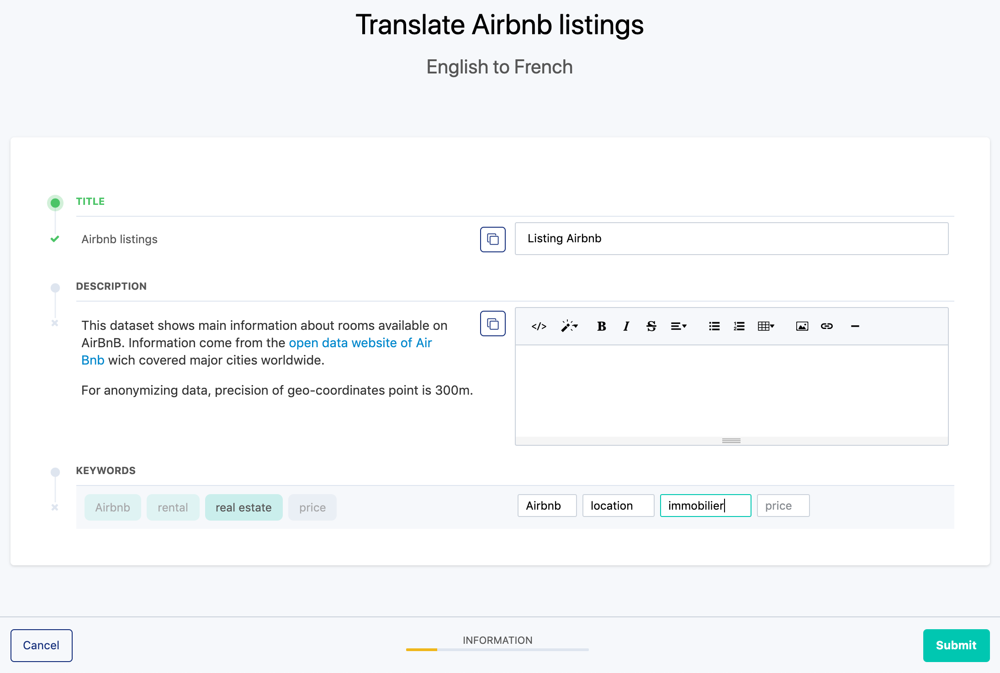
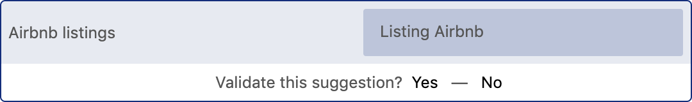

Translating a dataset
=====================

For domains with more than one language activated in the front office, Opendatasoft allows the translation of specific elements of the datasets and their metadata. When translated, this information appears in the language the user selected to navigate the portal. It should help them understand the dataset as best as possible, even though the data itself is not in their preferred language.

In the Opendatasoft platform, these translations are done in the Translations tab of the edition interface of each dataset.

Choosing elements for translation
---------------------------------

For each available language displayed in the Translations tab, it is possible to translate various elements that have been originally configured in 2 other configuration tabs of the dataset.

- The :doc:`Information tab</publishing_data/06_configuring_metadata/configuring_metadata>`, which contains 4 standard metadata that can be translated: Title, Description, Keywords, and Publisher.
- The :doc:`Processing tab</publishing_data/05_processing_data/processing_data>`, which contains the dataset fields labels and descriptions that can also be translated.

.. admonition:: Note
   :class: note

   For each language, for both Information and Processing, a progress bar is displayed to indicate how much of the elements have already been translated.

To start translating chosen elements from the dataset:

1. Choose an available language.
2. For the chosen language, choose whether to translate elements from the Information or the Processing tab.
3. For the chosen tab, click on the related Edit link. A translation interface appears.

.. admonition:: Important
   :class: important

   The translation interface only enables the translation of elements that have already been configured in the original language. For example, if the Publisher metadata has not been configured in the Information tab, it will not be possible to translate it.

The left side of the translation interface displays the elements that can be translated, along with their value in the original language.

- Untranslated elements are preceded by a grey |icon-cross| icon.
- Translated elements are preceded by a green |icon-check| icon.

The right side displays the text boxes where the translations should be written. The translations can be:

- suggestions proposed by the platform, or
- new translations.

.. admonition:: Important
   :class: important

   If an element is not translated, it will appear in the portal in its original value, no matter the language selected by the user.

   If an original element is modified after it has been translated, a notification will be displayed in the Translation tab, as well as in the translation interface. In the latter, one can choose to keep the current translation or modify it. Until this has been done, the original non-translated value will be displayed in the published dataset.

Managing translations in the translation interface
--------------------------------------------------

Approving or rejecting translation suggestions
^^^^^^^^^^^^^^^^^^^^^^^^^^^^^^^^^^^^^^^^^^^^^^

If a value has already been translated in any dataset of the domain, the platform will automatically suggest that translation for the same value. In that case, the suggested translation is automatically written in the translation text box as a proposition that can either be validated or rejected.

1. Click *Yes* to validate the suggestion or *No* to reject the suggestion.
2. Click the Submit button to save the translations.

.. admonition:: Note
   :class: note

   To validate all translation suggestions, click the Validate all suggestions button in the top-right hand corner of the translation interface.

Adding new translations
^^^^^^^^^^^^^^^^^^^^^^^

If a value has never been translated, or if the translation suggestion was rejected, a new translation should be added.

1. Add new translations in the right text boxes.
2. Click the Submit button to save the translations.

.. admonition:: Note
   :class: note

   If the original value should be kept as is (for example, a producer name), click the |icon-copy-value| button to fill up the translation text box with that same value.

