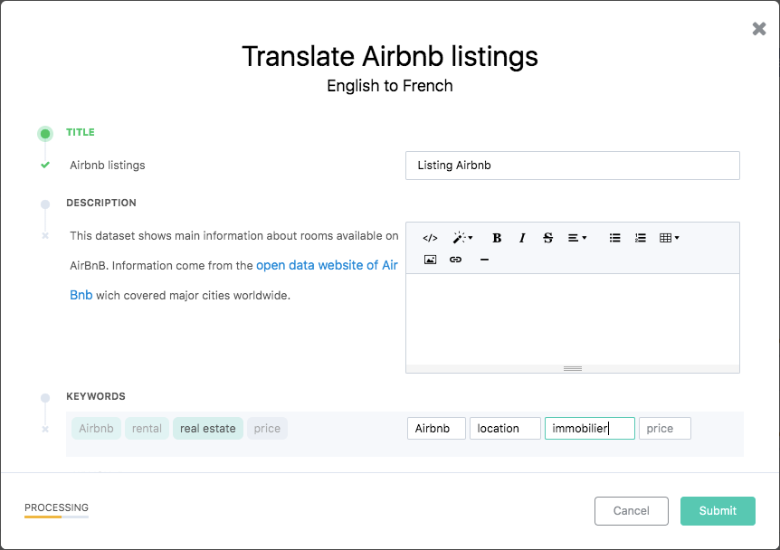

Translating a dataset
=====================

For domains with more than one language activated in the front office, Opendatasoft allows the translation of specific elements of the datasets, as well as their metadata. It should help users understand a dataset as best as possible, even though the data itself is not in their preferred language.

In the Opendatasoft platform, these translations are done in the Translations tab of the edition interface of each dataset.

.. image:: images/translation_tab_interface.png

Choosing elements for translation
---------------------------------

For each available language displayed in the Translations tab, it is possible to translate various elements that have been originally configured in 2 other configuration tabs of the dataset:

- Information, which 4 following metadata can be translated: Title, Description, Keywords and Publisher.
- Processing, which fields names and descriptions can be translated.

.. admonition:: Note
   :class: note

   For each language, for both Information and Processing, a progress bar is displayed to indicate how much of the elements have already been translated.

To start translating chosen elements from the dataset:

1. Choose an available language.
2. For the chosen language, choose whether to translate elements from the Information or the Processing tab.
3. For the chosen tab, click on the related Edit link. A translation window opens.

.. admonition:: Important
   :class: important

   The translation window only enables the translation of the metadata that have already been configured in the original language.

The left side of the translation window- displays the elements that can be translated, along with their value in the original language.

- Untranslated elements are preceded by a grey |icon-cross| icon.
- Translated elements are preceded by a green |icon-check| icon.

The right side is the translation area. It displays the textboxes where the translations should be written. The translations can either be:

- suggestions proposed by the platform,
- or, new translations.

Managing translations in the translation window
-----------------------------------------------

Approving or rejecting translation suggestions
^^^^^^^^^^^^^^^^^^^^^^^^^^^^^^^^^^^^^^^^^^^^^^

If a value has already been translated, the platform will automatically suggest that translation for the same value. In that case, the suggested translation is automatically proposed in the translation textbox.

1. Click X to validate the suggestion, or, click X to reject the suggestion.
2. Click the Submit button to save the translations.

.. admonition:: Note
   :class: note

   To validate all translations suggestions, click the Validate all suggestions button in the top right hand corner of the translation window.

Adding new translations
^^^^^^^^^^^^^^^^^^^^^^^

If a value has never been translated, or if the translation suggestion was rejected, a new translation should be added.

1. Add new translations in the right textboxes.
2. Click the Submit button to save the translations.

.. |icon-cross| image:: images/icon_cross.png
    :width: 10px
    :height: 9px

.. |icon-check| image:: images/icon_check.png
    :width: 12px
    :height: 9px
