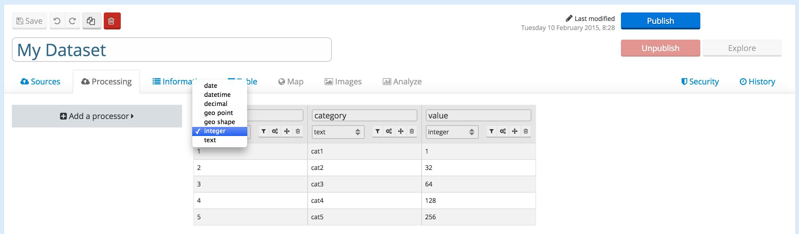

The dataset schema
==================

As seen in a previous article, a dataset content can be seen as flat database table. That is:

* A schema (the list of fields along with their types and possibily some annotations)
* A set of records (rows or tuples) matching the schema

Whatever the original data source format is, the dataset content ends up as a flat database table content.

Fields have a type. The following types are available:

.. list-table::
   :header-rows: 1

   * * Type
     * Description
   * * Date
     * Like 2015/02/11 or 2015-02-11 or 02/11/2015... . The platform will try to guess as accurately as possible the
       input date format. However, in case of bad detection or ambiguity, do not hesitate to use the
       **Date Normalizer** processor which lets you define precisely the parsing format of your date field.
   * * DateTime
     * Like 2015/02/11-08:09:10 or 2015-02-11T08:09:10 or 02/11/2015 08:09:10... . Timezone specifications are also
       processed. The platform will try to guess as accurately as possible the input datetime format. However, in case
       of bad detection or ambiguity, do not hesitate to use the **Date Normalizer** processor which lets
       you define precisely the parsing format of your datetime field.
   * * Decimal
     * A decimal number. Valid separators for the decimal part are '.' or ','. The space character can also be used as
       a thousands separator but not the ','.
   * * Geo Point
     * A single geographical location expressed in the format *<LAT>,<LON>*, for instance
       *45.8,2.5*. If your dataset contains two fields, latitude and longitude, you'll need to concatenate them
       with a **Concatenate Text** processor to form a valid geo point field.
   * * GeoShape
     * A valid geo shape expressed in `GeoJSON <http://geojson.org/geojson-spec.html>`_. For example :
       { "type": "LineString", "coordinates": [ [100.0, 0.0], [101.0, 1.0] ] }.
       We do not support feature collections, only
   * * Integer
     * Any valid integer value. If a floating point value is found, it is automatically cast to its integer part.
   * * Text
     * Anything
   * * File
     * A file. Created from a File processor or a specific extractor.

Next to their type, any field has a set of action items, which can be used to further refine your dataset schema.

* The **filter action** lets you define a **facet** for the field.
* The **field configuration action** will be described in more details below.
* The **reorder fields action** lets you reorder dataset fields at your convenience. This only affects the dataset
  API output.
* The **hide fields action** lets you hide specific dataset fields. Hidden fields are displayed at the right hand side
  of the table view and can easily be recovered.

Configuring a field
-------------------

The **field configuration button** allows you to fine tune your field's configuration.

.. image:: publish__fieldannotations--en.jpg
   :alt: Dataset Processors

The generic option **ID** lets you define the record id computing policy. Each record is uniquely identified by its
id, which is by default computed as the fingerprint of all the record fields values. The **ID** option lets you choose
which fields are going to be used when computing the record id, making it possible to handle records deduplication at
record fields level.

You then have access to a wide range of options depending on the field type.

* Text fields
    * **Sortable**

        By default, textual fields are not sortable. This option lets you activate sorting on textual fields.

    * **Multivalued**

        This option lets you define the separator that will be used to interpret multi-valued fields. This option is
        used for multi-value facetting. For instance, let's assume that a field named *countries* and defined as a
        facet contains values such as *France;UK;USA*. By setting this field as multivalued and defining the separator
        as being the ';' character, the values displayed in the facets widget will indeed be distinct (one entry for
        *France*, one entry for *UK*, one entry for *USA*).

    * **Hierarchical**

        This property is used in conjunction with facetting. By default, facets are processed as a single, raw textual
        content. But sometimes, you may want to build hierarchical facets navigation. This option lets you choose the
        hierarchy path separator to be used.

* Date and DateTime fields
    * **Precision**

        This option lets you choose the precision of a temporal field (year, month and day for a Date field, hour and minute for a DateTime field).

* Decimal and Integer fields
    * **Unit**

        This option lets you define an unit associated with numerical fields. This option is used to
        complement the table view and is displayed next to the field's value.

Special fields
==============

Record_id
---------

We identify a record with an unique field named record_id.
During the processing, if two records have the same record_id, the first one is replaced by the second.

The record_id is compute at the end with the following rules:

#. Filter the fields. Keep all the fields which are mark as 'ID' or all the fields if no field is mark as id.
#. Sort the fields values.
#. Concat the sorted values.
#. Apply a hash function (sha1) to the string

.. ifconfig:: language == 'en'

    .. image:: dataset_schema__record_id--en.png
        :alt: Record id schema

.. ifconfig:: language == 'fr'

    .. image:: dataset_schema__record_id--fr.png
        :alt: Record id schema

Record_timestamp
----------------

A record_timestamp field is generated for all records, its is a timestamp giving information about the creation date of the record.
The value depends on the extractor type.
For example on a csv file, the record_timestamp is a last modified date. On a realtime dataset, the record_timestamp is the date when the record arrived on the platform.