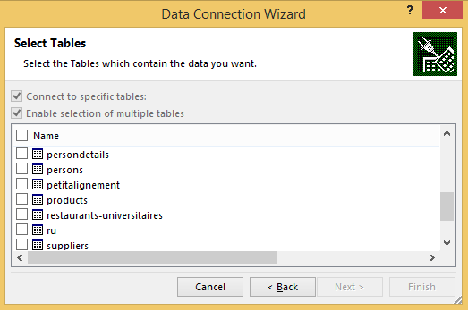
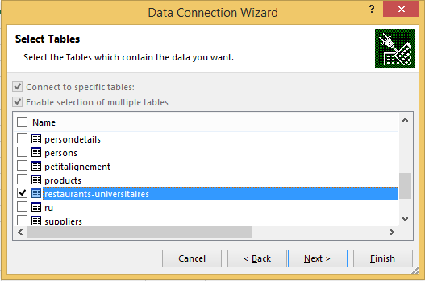
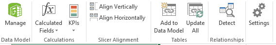
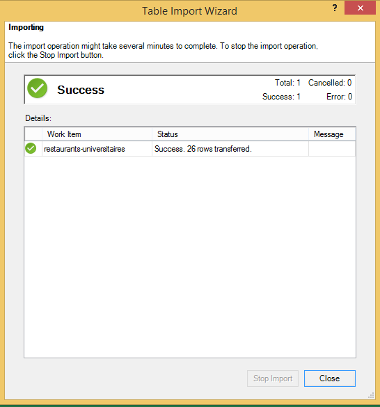
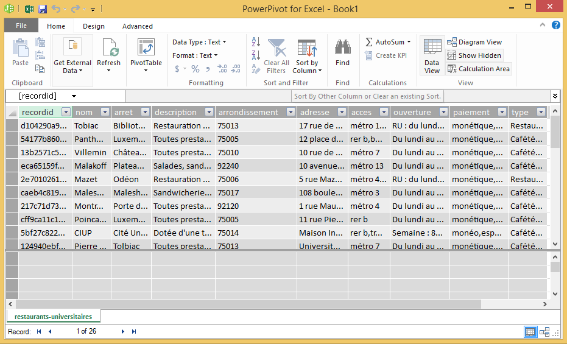

Microsoft Excel integration
===========================

The OpenDataSoft OData service makes it possible to gather data directly from Microsoft Excel, without any programming 
knowledge. There are 3 ways to proceed: first, for Microsoft Excel 2013, the OData native integration can be used. For 
Excel 2010 and Excel 2013, PowerPivot and PowerQuery extensions can be used. This article will give a detailed 
explanation on how to do it.

Native Integration
------------------

Here are the steps that will allow you to import data through the Excel native OData integration.

.. figure:: data1.png

   Data sources supported natively by Microsoft Excel.

* To import data from OpenDataSoft OData service, open Microsoft Excel and click the "DATA" tab. Once done, click 
  "From Other Source". This should let you see the list of supported data sources. Select "From OData Feed".

.. figure:: data2.png

   Data feed connection form.

* In the address bar of the window that was opened, enter the service address. This address should be 
  "http://platform.url/api/odata". Replace the platform.URL by the actual platform URL.

   Table selection window.

* Select the table(s) of your choosing by clicking their checkbox.

   A table selected to become a data source.

* After validation, the "Import Data" window will open. Click "OK".

.. figure:: data5.png

   The "Import Data" window.

* Your data are now displayed in the Microsoft Excel cells.
 
.. figure:: data6.png

   Imported data in Microsoft Excel.

PowerPivot
----------

Here are the steps that will allow you to import data through PowerPivot for Microsoft Excel.

.. figure:: ppivot1.png

   "Add-Ins" tab in the Microsoft Excel settings window.

* Before you can use PowerPivot, you must activate it. To do so, open the "Add-ins" tab in the Microsoft Excel settings 
  window. In the "Manage" drop down menu, select "COM Add-ins" and click "Go...".

.. figure:: ppivot2.png

   The COM add ins selection window.

* In the window that was just opened, select "Microsoft PowerPivot for Excel 2013" or 
  "Microsoft PowerPivot for Excel 2010", whichever applies.

   PowerPivot menu bar.

* Back in Microsoft Excel main window click the "POWERPIVOT" tab to display the PowerPivot menu bar. In it, click the 
  "Manage" button. It will open a source management window.

.. figure:: ppivot4.png

   Data sources management window.

* In this window, click "Get External Data", and in the menu that appears, click "From Data Service". In the second 
  menu that appears, click "From OData Data Feed"

.. figure:: ppivot5.png

   Data feed connection window.

* In the import window that was opened, enter the OpenDataSoft OData service in the address bar.

.. figure:: ppivot6.png

   Table selection window.

* In the table selection window, select the dataset(s) of your choosing by clicking their checkbox. Once done, click 
  "Finish".

   Data transfer window.

* When the transfer window shows a success indicator, close it with the "Close" button on the bottom right.

   Data preview.

* You can now verify the integrity of your data om the data source management window.

.. figure:: ppivot10.png

   The data import list in PowerPivot.

* In the Microsoft Excel main window, click "PivotTable", and in the popped up list, click "PivotTable".

.. figure:: ppivot11.png

   The destination selection window.

* In the destination selection window, select the worksheet of your choosing, and click "OK".

.. figure:: ppivot12.png

   Data aggregation using PowerPivot.

Power Query
-----------

Here are the steps that will allow you to import data through Power Query for Microsoft Excel.

* Before you can use Power Query, you must download and activate it. To download it, visit 
  `this link <http://www.microsoft.com/en-us/download/details.aspx?id=39379>`_. The activation process is similar to 
  that of PowerPivot.

.. figure:: pquery1.png

   Data sources supported by Microsoft Power Query.

* Once done, return to Microsoft Excel main window, click "POWER QUERY" to display its menu bar. In the 
  "POWER QUERY" menu bar, click "From Other Sources". You should see a list with all data sources supported by 
  Microsoft Power Query.

.. figure:: pquery2.png

   OData data source selection window.

* In this window, enter the OpenDataSoft OData service URL and click "OK".

.. figure:: pquery3.png

   Power Query navigation window.

* Once done, a Power Query navigation window will be displayed on the right hand side of the main window. In it, click 
  the IDs of the table of your choosing.

.. figure:: pquery4.png

   Imported data through Power Query.

* Your data is now displayed in the Microsoft Excel cells.
