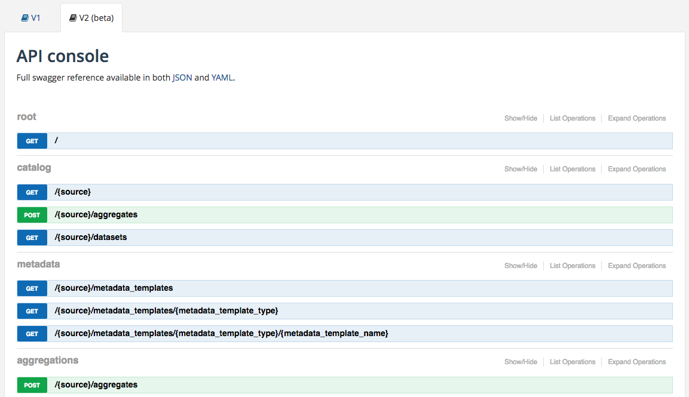

Introduction
============

OpenDataSoft datasets can be accessed by developers through HTTP REST APIs.

The domain `<http://public.opendatasoft.com>`_ will be use to illustrate examples given in this forum.

Philosophy
----------

APIv2 is a HATEOAS API. It means that a client can interact with API via hypermedia links returned by each entry point.
For instance a basic call to the API root entry point ``/api/v2`` will return all possible API calls from this specific path :

.. code-block:: json

    {
        "links": [
            {
                "href": "http://public.opendatasoft.com/api/v2/",
                "rel": "self"
            },
            {
                "href": "http://public.opendatasoft.com/api/v2/catalog",
                "rel": "catalog"
            },
            {
                "href": "http://public.opendatasoft.com/api/v2/monitoring",
                "rel": "monitoring"
            },
            {
                "href": "http://public.opendatasoft.com/api/v2/opendatasoft",
                "rel": "opendatasoft"
            }
        ]
    }

Sources
-------

Three sources are available under ``v2`` path. Each source represents a different catalog to retrieve datasets from.

.. list-table::
    :header-rows: 1

    * * Source name
      * Description
    * * ``catalog``
      * Work on datasets from current domain.
        Example: ``http://public.opendatasoft.com/api/v2/catalog/datasets/`` return all datasets from domain ``public``.
    * * ``monitoring``
      * Work on monitoring datasets for the current domain.
    * * ``opendatasoft``
      * Work on opendatasoft public catalog.

Query Language
--------------

When performing a search request (for instance search or aggregate on records), it is possible to filter the data to work on.
This query language is the same for all the entry_point and is described in query_language section.

Virtual Fields
--------------

Virtual field is a new concept in APIv2. A virtual field provides the possibility to work on a field that does not exist in the source dataset.
It is a constructed as a result of an expression. Examples : ``my_virtual_field#2*3`` or an expression with an existing field ``my_virtual_field2#2*field``
Then, a virtual field can be used in an aggregation query, or as a sort expression.
